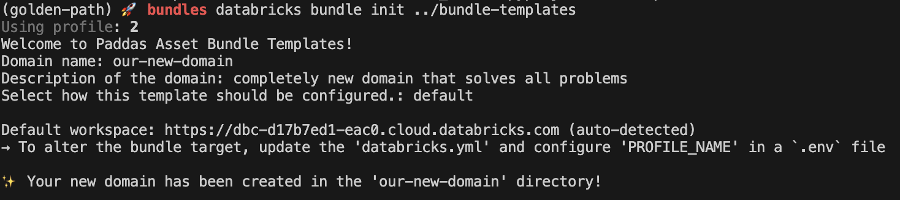

# Padda Asset Bundle Templates

The `Padda Asset Bundle Templates` contains our own custom templates for Databricks Asset Bundles. The template provides a good start for structure and where it possible som standard values based on good practise from Dataspeilet.

## Why This Template?

This template solves common pain points in Databricks project setup:

- **Streamlined Setup**: One command creates a fully configured development environment
- **Modern Python Tooling**: Uses `uv` for fast package management, `ruff` for linting, and `mypy` for type checking (pending `ty` reaching production-ready status)
- **Modular Architecture**: Core template is lightweight with optional accelerators for specialized needs
- **Development Environment**: DevContainer for consistent development across platforms

## Getting started

1. Initialize a new project using the template:

    ```bash
    databricks bundle init https://github.com/oslokommune/padda-golden-path/bundles-templates
    ```

    

    When initializing your project, you'll be prompted to answer several questions. These configurations will be used to customize your project:

    | Parameter | Description | Example | Condition |
    | --------- | ----------- | ------- | --------- |
    | `domain_name` | Name of the domain | `padda-test-domain` | |
    | `domain_description` | Brief description of the domain | `This domain is generated using our own Padda Asset Bundle Templates.` | |
    | `setup_type` | Type of setup (`default`, `minimal` or `custom`) | `default` | |
    | `include_example_jobs` | Whether to include example pipelines and jobs | `yes/no` | `setup_type` = `custom` |
    | `include_dab_recipes` | Whether to include just recipes for Databricks Bundle commands | `yes/no` | `setup_type` = `custom` |

    > Previously, specifying a `package_name` was required. The `package_name` is now automatically generated from the `domain_name` by replacing dashes (`-`) with underscores (`_`) following Python package naming conventions.

    This table contains the values passed for setup types `default` and `minimal`. When `setup_type` is `custom`, the values are determined by the user's choices.

    | Parameter | Default | Minimal |
    | --------- | ------- | ------- |
    | `include_example_jobs` | `yes` | `no` |
    | `include_dab_recipes` | `yes` | `no` |


## Developing the Template

Databricks Asset Bundle Templates use `Go` template syntax with conditional logic based on the parameters above.

Key development files:

- `template/__preamble.tmpl` - Controls file inclusion using `{{skip}}` directives
- `databricks_template_schema.json` - Defines template variables and validation
- Files with `.tmpl` extension are rendered with `{{.parameter_name}}` replaced accordingly

Test locally using:

```bash
databricks bundle init https://github.com/oslokommune/padda-golden-path/bundles-templates --branch <branch_name>
```