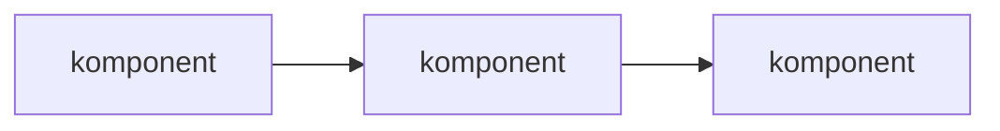

<!--
  MAL: FORKLARING — forståelsesrettet, diskuterende

  Bruk denne malen for sider under "Om plattformen", eller andre steder
  der leseren trenger kontekst, bakgrunn eller svar på "hvorfor?".

  Eksempler fra vår dokumentasjon:
    - Arkitektur
    - Datainnlasting og klassifisering
    - Datatilgang og deling
    - Overvåking
    - Hva tilbyr dataplattformen?
    - Velg riktig dataplattform
    - Bruksområder
    - Målgrupper og forutsetninger

  Viktige prinsipper:
    - Dette er den frieste typen — tenk artikkel eller essay, ikke skjema
    - Svar på "hvorfor?", ikke "hvordan?"
    - Ingen trinn-for-trinn-instruksjoner (det er en how-to eller tutorial)
    - Ingen tekniske spesifikasjoner eller parameterlister (det er referanse)
    - Diskuterende, reflekterende tone — det er OK å uttrykke mening
      med begrunnelse
    - Seksjonene under er en MENY, ikke en sjekkliste — velg de som
      passer temaet ditt

  Tips om formatering:
    - Mermaid-diagrammer er gode for å vise sammenhenger og flyt
    - Bruk example-admonition for konkrete illustrasjoner av
      abstrakte konsepter
    - Unngå for mange admonitions — de bryter leseopplevelsen i en
      sammenhengende tekst
-->

# [Tema]

<!-- OBLIGATORISK -->
<!-- Kort innledning: hva temaet er, hvorfor det er relevant, og hvilket
     spørsmål denne teksten hjelper med å besvare. Dette setter rammen. -->

[Forklar hva temaet er, hvorfor det er relevant, og hvilket spørsmål denne teksten hjelper med å besvare.]

<!--
  == VELG SEKSJONENE SOM PASSER TEMAET DITT ==

  Overskriftene under er forslag. Bruk de som tjener artikkelen din,
  gi dem gjerne nye navn, og hopp over resten. De eneste harde kravene
  er innledningen over og lenker til relatert innhold nederst.
-->

## Det store bildet

<!-- VALGFRI: Bruk når temaet må plasseres i en større sammenheng.
     Passer godt for arkitektur- og strategitemaer som "Arkitektur"
     eller "Hva tilbyr dataplattformen?".

     Et Mermaid-diagram kan være mer effektivt enn tekst for å vise
     hvordan komponenter henger sammen: -->

- [hvilken del av systemet eller domenet dette hører til]
- [hvilket problem det er ment å løse]
- [hvordan det påvirker resten av løsningen]

## Hvorfor [dette finnes / vi gjør det slik]

<!-- VALGFRI: Bruk når leseren trenger å forstå begrunnelsen bak et
     design, en policy eller et valg. Passer godt for "Arkitektur" og
     "Datainnlasting og klassifisering". -->

[Beskriv hvorfor denne mekanismen, funksjonen eller arkitekturen eksisterer.]

Mulige perspektiver:

- [forretningsbehov]
- [tekniske begrensninger]
- [sikkerhetskrav]
- [historiske årsaker]

## Hvordan delene henger sammen

<!-- VALGFRI: Bruk når temaet involverer flere komponenter, lag eller
     begreper som samvirker. Passer godt for "Arkitektur" og
     "Datatilgang og deling". -->

[Beskriv relasjoner mellom viktige komponenter, begreper eller nivåer.]

- [del A] påvirker [del B] fordi ...
- [del C] brukes når ...

## Avveininger og alternativer

<!-- VALGFRI: Bruk når det finnes reelle avveininger eller konkurrerende
     tilnærminger som leseren bør forstå. Passer godt for
     "Velg riktig dataplattform" og "Arkitektur". -->

[Drøft hvorfor én løsning ble valgt fremfor en annen.]

- [alternativ A] vs. [alternativ B]
- [fordeler og ulemper]
- [når ett valg passer bedre enn et annet]

## Begrensninger

<!-- VALGFRI: Bruk når designet har kjente begrensninger leseren bør
     kjenne til. -->

[Beskriv hvilke konsekvenser eller begrensninger designet har.]

## Historikk

<!-- VALGFRI: Bruk når historisk kontekst genuint hjelper leseren forstå
     nåværende tilstand. Ikke ta med bare for å ta med. -->

[Ta med historiske eller organisatoriske forhold som forklarer dagens løsning.]

## Vanlige misforståelser

<!-- VALGFRI: Bruk når du vet at spesifikke misoppfatninger er utbredt
     blant brukere. -->

### [Misforståelse]

[Hvorfor den oppstår, og hva som faktisk gjelder.]

## Relatert innhold

<!-- OBLIGATORISK: Lenk alltid til konkrete sider i dokumentasjonen. -->

- [Lenke til relevant tutorial under "Kom i gang"]
- [Lenke til relevant guide under "Guider"]
- [Lenke til relevant referanseside]
