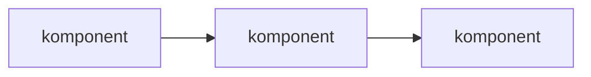

!!! info "Mal: Forklaring — forståelsesrettet, diskuterende"
    Bruk denne malen for sider der leseren trenger kontekst, bakgrunn
    eller svar på "hvorfor?" (f.eks. sider under "Om plattformen").

    **Prinsipper:**

    - Dette er den frieste typen — tenk artikkel eller essay, ikke skjema
    - Svar på "hvorfor?", ikke "hvordan?"
    - Ingen trinn-for-trinn-instruksjoner (det er en how-to eller tutorial)
    - Ingen tekniske spesifikasjoner eller parameterlister (det er referanse)
    - Diskuterende, reflekterende tone — det er OK å uttrykke mening
      med begrunnelse

    **Formatering:**

    - Mermaid-diagrammer er gode for å vise sammenhenger og flyt
    - Bruk `!!! example` for konkrete illustrasjoner av abstrakte konsepter
    - Unngå for mange admonitions — de bryter leseopplevelsen

    **Seksjonene under er en meny, ikke en sjekkliste** — velg de som
    passer temaet ditt, gi dem gjerne nye navn, og hopp over resten.

    Slett denne boksen når du begynner å skrive.

# [Tema]

[Forklar hva temaet er, hvorfor det er relevant, og hvilket spørsmål denne teksten hjelper med å besvare. Dette setter rammen.] [OBLIGATORISK]

## Det store bildet [FRIVILLIG]

Bruk når temaet må plasseres i en større sammenheng.

- [hvilken del av systemet eller domenet dette hører til]
- [hvilket problem det er ment å løse]
- [hvordan det påvirker resten av løsningen]

## Hvorfor [dette finnes / vi gjør det slik] [FRIVILLIG]

Bruk når leseren trenger å forstå begrunnelsen bak et design, en policy eller et valg.

- [forretningsbehov]
- [tekniske begrensninger]
- [sikkerhetskrav]
- [historiske årsaker]

## Hvordan delene henger sammen [FRIVILLIG]

Bruk når temaet involverer flere komponenter, lag eller begreper som samvirker.

- [del A] påvirker [del B] fordi ...
- [del C] brukes når ...

## Avveininger og alternativer [FRIVILLIG]

Bruk når det finnes reelle avveininger eller konkurrerende tilnærminger.

- [alternativ A] vs. [alternativ B]
- [fordeler og ulemper]
- [når ett valg passer bedre enn et annet]

## Begrensninger [FRIVILLIG]

Bruk når designet har kjente begrensninger leseren bør kjenne til.

## Historikk [FRIVILLIG]

Bruk når historisk kontekst genuint hjelper leseren forstå nåværende tilstand. Ikke ta med bare for å ta med.

## Vanlige misforståelser [FRIVILLIG]

Bruk når du vet at spesifikke misoppfatninger er utbredt blant brukere.

### [Misforståelse]

[Hvorfor den oppstår, og hva som faktisk gjelder.]

## Relatert innhold [OBLIGATORISK]

- [Lenke til relevant tutorial]
- [Lenke til relevant guide]
- [Lenke til relevant referanseside]
