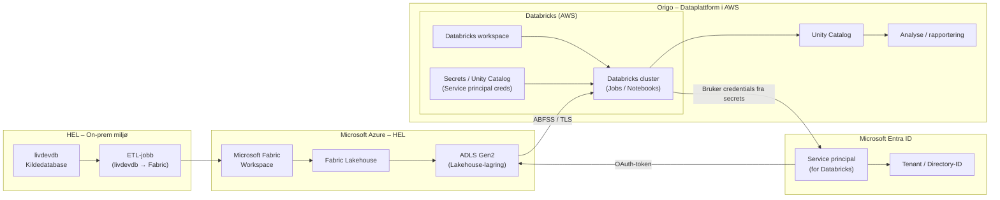

```mermaid
flowchart LR
  %% HEL on-prem
  subgraph HEL_OnPrem["HEL – On-prem miljø"]
    livdevdb["livdevdb <br/>Kildedatabase"]
    etl["ETL-jobb <br/> (livdevdb → Fabric)"]
    livdevdb --> etl
  end

  %% Azure (Fabric + ADLS)
  subgraph Azure["Microsoft Azure – HEL"]
    fab_ws["Microsoft Fabric <br/> Workspace"]
    lakehouse["Fabric Lakehouse"]
    adls["ADLS Gen2 <br/> (Lakehouse-lagring)"]

    etl --> fab_ws
    fab_ws --> lakehouse
    lakehouse --> adls
  end

  %% Entra ID / Azure AD
  subgraph Entra["Microsoft Entra ID"]
    sp["Service principal <br/> (for Databricks)"]
    tenant["Tenant / Directory-ID"]
    sp --> tenant
  end

  %% AWS / Origo / Databricks
  subgraph AWS["Origo – Dataplattform i AWS"]
    subgraph DBX["Databricks (AWS)"]
      dbx_ws["Databricks workspace"]
      dbx_cluster["Databricks cluster <br/> (Jobs / Notebooks)"]
      secrets["Secrets / Unity Catalog <br/> (Service principal creds)"]

      dbx_ws --> dbx_cluster
      secrets --> dbx_cluster
    end

    uc["Unity Catalog"]
    consumers["Analyse / rapportering"]

    dbx_cluster --> uc
    uc --> consumers
  end

  %% Cross-cloud-kommunikasjon
  adls -- "ABFSS / TLS" --> dbx_cluster
  dbx_cluster -- "Bruker credentials fra secrets" --> sp
  sp -- "OAuth-token" --> adls
```