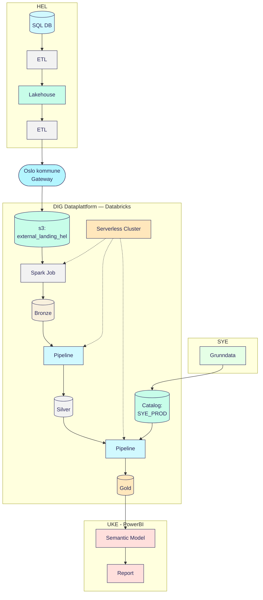

# Dataflyt for SYE

```mermaid
flowchart TD
  subgraph HEL
    direction LR
    sqldb[(SQL DB)] --> etl1[ETL] --> lh[Lakehouse] --> etl2[ETL]
  end

  gw([Oslo kommune<br>Gateway])

  subgraph SYE
    grunndata[Grunndata]
  end

  subgraph DIG["DIG Dataplattform — Databricks"]
    direction LR
    landing[(s3:<br>external_landing_hel)] --> spark[Spark Job]
    cluster[Serverless Cluster] -.-> spark
    cluster -.-> p1
    cluster -.-> p2
    sye_prod[(Catalog:<br>SYE_PROD)] --> p2
    spark --> bronze[(Bronze)] --> p1[Pipeline] --> silver[(Silver)] --> p2[Pipeline] --> gold[(Gold)]
  end

  subgraph UKE["UKE - PowerBI"]
    direction LR
    semantic[Semantic Model] --> report[Report]
  end

  etl2 --> gw
  gw --> landing
  grunndata --> sye_prod
  gold --> semantic

  style sqldb fill:#d1f9ff,stroke:#2a2859,color:#2a2859
  style lh fill:#c7fde9,stroke:#2a2859,color:#2a2859
  style gw fill:#b3f5ff,stroke:#2a2859,color:#2a2859
  style grunndata fill:#e5ffe6,stroke:#2a2859,color:#2a2859
  style landing fill:#c7fde9,stroke:#2a2859,color:#2a2859
  style sye_prod fill:#c7fde9,stroke:#2a2859,color:#2a2859
  style spark fill:#f2f2f2,stroke:#2a2859,color:#2a2859
  style cluster fill:#ffe7bc,stroke:#2a2859,color:#2a2859
  style bronze fill:#f8f0dd,stroke:#2a2859,color:#2a2859
  style silver fill:#f2f2f2,stroke:#2a2859,color:#2a2859
  style gold fill:#ffe7bc,stroke:#2a2859,color:#2a2859
  style p1 fill:#d1f9ff,stroke:#2a2859,color:#2a2859
  style p2 fill:#d1f9ff,stroke:#2a2859,color:#2a2859
  style semantic fill:#ffdfdc,stroke:#2a2859,color:#2a2859
  style report fill:#ffdfdc,stroke:#2a2859,color:#2a2859
  style etl1 fill:#f2f2f2,stroke:#2a2859,color:#2a2859
  style etl2 fill:#f2f2f2,stroke:#2a2859,color:#2a2859
```
