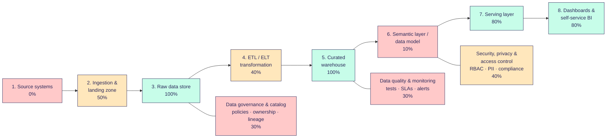

# Progresjon i utviklingen

```mermaid
flowchart LR
  s1[1. Source systems<br>0%] --> s2[2. Ingestion &<br>landing zone<br>50%]
  s2 --> s3[3. Raw data store<br>100%]
  s3 --> s4[4. ETL / ELT<br>transformation<br>40%]
  s4 --> s5[5. Curated<br>warehouse<br>100%]
  s5 --> s6[6. Semantic layer /<br>data model<br>10%]
  s6 --> s7[7. Serving layer<br>80%]
  s7 --> s8[8. Dashboards &<br>self-service BI<br>80%]

  s3 --- gov[Data governance & catalog<br>policies · ownership · lineage<br>30%]
  s5 --- qual[Data quality & monitoring<br>tests · SLAs · alerts<br>30%]
  s6 --- sec[Security, privacy &<br>access control<br>RBAC · PII · compliance<br>40%]

  style s1 fill:#ffc9c9,stroke:#2a2859,color:#2a2859
  style s2 fill:#ffe7bc,stroke:#2a2859,color:#2a2859
  style s3 fill:#c7fde9,stroke:#2a2859,color:#2a2859
  style s4 fill:#ffe7bc,stroke:#2a2859,color:#2a2859
  style s5 fill:#c7fde9,stroke:#2a2859,color:#2a2859
  style s6 fill:#ffc9c9,stroke:#2a2859,color:#2a2859
  style s7 fill:#c7fde9,stroke:#2a2859,color:#2a2859
  style s8 fill:#c7fde9,stroke:#2a2859,color:#2a2859
  style gov fill:#ffc9c9,stroke:#2a2859,color:#2a2859
  style qual fill:#ffc9c9,stroke:#2a2859,color:#2a2859
  style sec fill:#ffe7bc,stroke:#2a2859,color:#2a2859
```
