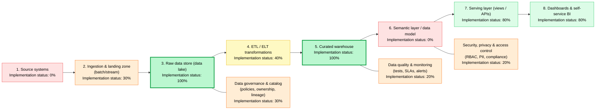

```mermaid
flowchart LR
  %% Implementation status styles (change classes as progress increases)
  classDef p0   fill:#fee2e2,stroke:#ef4444,color:#000;
  classDef p25  fill:#ffedd5,stroke:#f97316,color:#000;
  classDef p50  fill:#fef9c3,stroke:#eab308,color:#000;
  classDef p75  fill:#dcfce7,stroke:#22c55e,color:#000;
  classDef p100 fill:#bbf7d0,stroke:#16a34a,stroke-width:3px,color:#000;

  %% Main lifecycle: source -> dashboard
  SRC["1. Source systems<br/>Implementation status: 0%"]:::p0
  INGEST["2. Ingestion & landing zone<br/>(batch/stream)<br/>Implementation status: 30%"]:::p25
  RAW["3. Raw data store (data lake)<br/>Implementation status: 100%"]:::p100
  ETL["4. ETL / ELT transformations<br/>Implementation status: 40%"]:::p50
  CURATED["5. Curated warehouse<br/>Implementation status: 100%"]:::p100
  SEMANTIC["6. Semantic layer / data model<br/>Implementation status: 0%"]:::p0
  SERVE["7. Serving layer (views / APIs)<br/>Implementation status: 80%"]:::p75
  BI["8. Dashboards & self-service BI<br/>Implementation status: 80%"]:::p75

  SRC --> INGEST --> RAW --> ETL --> CURATED --> SEMANTIC --> SERVE --> BI

  %% Cross-cutting capabilities
  GOV["Data governance & catalog<br/>(policies, ownership, lineage)<br/>Implementation status: 30%"]:::p25
  DQ["Data quality & monitoring<br/>(tests, SLAs, alerts)<br/>Implementation status: 20%"]:::p25
  SEC["Security, privacy & access control<br/>(RBAC, PII, compliance)<br/>Implementation status: 20%"]:::p25

  RAW --- GOV
  CURATED --- DQ
  SEMANTIC --- SEC
```
