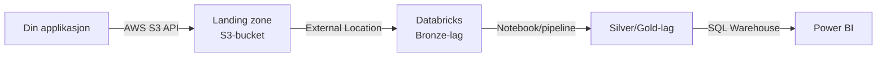
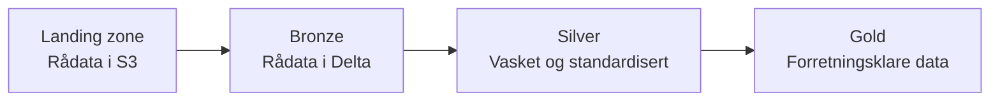

# Kom i gang — fra applikasjon til Power BI

Denne guiden gir deg en oversikt over alle stegene som trengs for å sette opp en fungerende datapipeline fra din applikasjon til Power BI via Padda-plattformen.

## Oversikt over dataflyten



| Steg                  | Hva                                            | Hvem            |
|-----------------------|------------------------------------------------|-----------------|
| 1. Onboarding         | Lese retningslinjer og bekrefte                | Ditt team       |
| 2. Landing zone       | Opprette sender i landing zone                 | Plattformteamet |
| 3. Last opp data      | Sende data fra app til S3                      | Ditt team       |
| 4. Les inn data       | Lese data fra landing zone inn i Databricks    | Ditt team       |
| 5. Transformer data   | Prosessere data gjennom bronze → silver → gold | Ditt team       |
| 6. Koble til Power BI | Koble Power BI til Databricks SQL Warehouse    | Ditt team       |

## Steg 1 — Onboarding

Før du kan bruke plattformen må du gjennomføre onboarding. Dette innebærer å lese retningslinjene og bekrefte at du forstår dem via en pull request.

Se [Onboarding](ONBOARDING.md) for detaljer.

## Steg 2 — Få en landing zone-sender

!!! info "Dette gjør plattformteamet for deg"
    Landing zone-bucketen opprettes og administreres av plattformteamet via Terraform (padda-iac). Du trenger **ikke** opprette S3-bucketen selv.

Hvert Databricks-workspace har **en** landing zone S3-bucket. Dataen din kommer inn via en **sender** — en logisk identitet som representerer kilden din (f.eks. din applikasjon).

**Slik får du en sender:**

1. Kontakt plattformteamet via [#dig-dataspeilet](https://oslokommune.slack.com/archives/C01SFNFEXK7) og oppgi:
    - Hvilket workspace du tilhører
    - Navnet du ønsker på senderen (f.eks. `min-app`)
    - Eventuell IP-begrensning for opplasting
2. Plattformteamet oppretter senderen. Det opprettes automatisk tre IAM-brukere med tilhørende prefikser basert på konfidensialitetsnivå:

    | IAM-bruker                 | S3-prefiks                    | Bruksområde         |
    |----------------------------|-------------------------------|---------------------|
    | `workspace-min-app-green`  | `s3://bucket/min-app/green/`  | Offentlige data     |
    | `workspace-min-app-yellow` | `s3://bucket/min-app/yellow/` | Interne data        |
    | `workspace-min-app-red`    | `s3://bucket/min-app/red/`    | Konfidensielle data |

3. Du mottar AWS-nøkler (access key + secret key) for den aktuelle brukeren over sikker kanal.

Se [Landing Zone](guides/data/landing-zone.md) for mer detaljer om struktur og tilgang.

## Steg 3 — Last opp data til landing zone

Når du har fått IAM-nøklene kan du laste opp data til landing zone fra din applikasjon.

### Filformat

Databricks håndterer mange formater, men vi anbefaler:

| Format            | Anbefalt for                          | Merknad                                        |
|-------------------|---------------------------------------|------------------------------------------------|
| **Parquet**       | Store datasett, kolonnebasert analyse | Best ytelse, sterk typing                      |
| **JSON** (ndjson) | API-responser, nestede strukturer     | En JSON-rad per linje                          |
| **CSV**           | Enkle tabulære data                   | Husk header-rad og konsistent encoding (UTF-8) |

!!! tip "Inkrementell opplasting"
    Organiser filer i mapper etter dato eller batch, f.eks.:

    ```
    s3://bucket/min-app/green/2026/02/17/data-001.parquet
    s3://bucket/min-app/green/2026/02/17/data-002.parquet
    ```

    Dette gjør det enkelt for Databricks Auto Loader å bare plukke opp nye filer.

### Eksempel: Last opp med Python (boto3)

```python
import boto3

s3 = boto3.client(
    "s3",
    region_name="eu-west-1",
    aws_access_key_id="DIN_ACCESS_KEY",
    aws_secret_access_key="DIN_SECRET_KEY",
)

s3.upload_file(
    Filename="data.parquet",
    Bucket="69d82-workspace-landing-zone",
    Key="min-app/green/2026/02/17/data.parquet",
)
```

!!! warning "Ikke hardkod nøkler"
    I produksjon bør du bruke Secrets Manager eller Parameter Store i stedet for å hardkode nøkler. Se [AWS SDK credential-dokumentasjon](https://boto3.amazonaws.com/v1/documentation/api/latest/guide/credentials.html) for alternativer.

### Eksempel: Last opp med AWS CLI

```bash
AWS_PROFILE=min-sender aws s3 cp data.parquet \
  s3://69d82-workspace-landing-zone/min-app/green/2026/02/17/data.parquet
```

Se [Landing Zone](guides/data/landing-zone.md) for oppsett av AWS-profil og mer om sikkerhetsnøkler.

## Steg 4 — Les data inn i Databricks

Når data ligger i landing zone kan du lese den inn i Databricks via en **External Location** som plattformteamet allerede har satt opp.

### Med Auto Loader (anbefalt)

Auto Loader overvåker landing zone og plukker automatisk opp nye filer. Bruk dette for inkrementell innlasting:

```python
df = (
    spark.readStream
    .format("cloudFiles")
    .option("cloudFiles.format", "parquet")
    .option("cloudFiles.schemaLocation", "/tmp/schema/min-app")
    .load("s3://69d82-workspace-landing-zone/min-app/green/")
)

df.writeStream.option("checkpointLocation", "/tmp/checkpoint/min-app").toTable(
    "min_katalog.bronze_default.min_tabell"
)
```

Auto Loader holder styr på hvilke filer som allerede er prosessert, slik at kun nye filer leses inn ved neste kjøring.

### Med batch-lesning

For enklere tilfeller kan du lese filer direkte:

```python
df = spark.read.format("parquet").load(
    "s3://69d82-workspace-landing-zone/min-app/green/2026/02/17/"
)

df.write.mode("append").saveAsTable("min_katalog.bronze_default.min_tabell")
```

### Med Databricks Asset Bundle (golden path)

Vi har ferdiglagde eksempler du kan kopiere og tilpasse:

- [Excel Ingestion Bundle](guides/data/laste-opp-excel-til-uc.md) — leser Excel-filer fra Unity Catalog Volume til Delta-tabell

Se [Databricks Bundles](golden-paths/databricks-bundles.md) for oversikt over alle tilgjengelige eksempler.

## Steg 5 — Transformer data (bronze → silver → gold)

Databricks-workspace er organisert etter **medallion-arkitekturen**:



| Lag | Schema | Formål |
|-----|--------|--------|
| **Bronze** | `bronze_default` | Rå kopi av data fra landing zone, minimalt prosessert |
| **Silver** | `silver_default` | Vasket, deduplisert, standardiserte kolonnenavn og typer |
| **Gold** | `gold_default` | Aggregert, forretningsklart, klart for analyse og BI |

Du bygger pipelines som notebooks eller Databricks-jobber, og deployer dem med [Databricks Asset Bundles](golden-paths/databricks-bundles.md).

## Steg 6 — Koble til Power BI

Når data ligger i gold-laget (eller silver, avhengig av behov) kan du koble til Power BI via Databricks SQL Warehouse.

**Slik kobler du til:**

1. **Finn tilkoblingsdetaljer** i Databricks:
    - Gå til **SQL Warehouses** i Databricks-workspacet
    - Velg ditt warehouse og klikk **Connection details**
    - Noter **Server hostname** og **HTTP path**

2. **Koble til fra Power BI Desktop:**
    - Åpne Power BI Desktop → **Get Data** → **Databricks**
    - Skriv inn **Server hostname** og **HTTP path**
    - Autentiser med din Databricks-konto
    - Velg katalog, schema og tabeller du vil bruke

3. **Publiser til Power BI Service** for å dele rapporter med andre.

!!! info "Tilgang"
    Du må ha tilgang til SQL Warehouse og de relevante katalogene/schemaene i Unity Catalog. Kontakt workspace admin om du mangler tilgang.

## Oppsummering

| Steg | Handling                       | Ressurs                                                                        |
|------|--------------------------------|--------------------------------------------------------------------------------|
| 1    | Onboarding                     | [Onboarding](ONBOARDING.md)                                                    |
| 2    | Få landing zone-sender         | Kontakt [#dig-dataspeilet](https://oslokommune.slack.com/archives/C01SFNFEXK7) |
| 3    | Last opp data til S3           | [Landing Zone](guides/data/landing-zone.md)                                    |
| 4    | Les inn i Databricks           | [Databricks Bundles](golden-paths/databricks-bundles.md)                       |
| 5    | Bygg pipelines (bronze → gold) | [Golden Paths](golden-paths/databricks-bundles.md)                             |
| 6    | Koble til Power BI             | SQL Warehouse connection details                                               |

## Trenger du hjelp?

- **Slack**: [#dig-dataspeilet](https://oslokommune.slack.com/archives/C01SFNFEXK7)
- **GitHub**: [oslokommune/padda-golden-path](https://github.com/oslokommune/padda-golden-path) — opprett et issue
