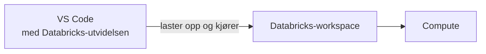

# Koble VS Code til Databricks

Du kan bruke en hvilken som helst teksteditor mot plattformen. Men bruker du VS Code,
lar den offisielle Databricks-utvidelsen deg kjøre fila du redigerer direkte på
workspacet, uten å pakke eller deploye noe først. Denne guiden viser hvordan du kobler
utvidelsen til workspacet ditt og kjører en fil på serverless compute.

Slik henger delene sammen:



## Før du begynner

Sørg for at du har:

- Gjennomført [Sett opp utviklingsmiljøet](../../kom-i-gang/dev-setup.md), spesielt
  innloggingen med `databricks auth login`, siden utvidelsen gjenbruker profilene i
  `~/.databrickscfg`.
- [VS Code](https://code.visualstudio.com/) installert.

## Trinn 1: Installer utvidelsen

1. Åpne **Extensions**-panelet i VS Code.
2. Søk etter «Databricks».
3. Installer den offisielle
   [Databricks-utvidelsen](https://marketplace.visualstudio.com/items?itemName=databricks.databricks).

## Trinn 2: Koble til workspacet

1. Opprett en tom mappe `databricks-demo` og åpne den i VS Code (**File → Open Folder**).
2. Klikk på Databricks-ikonet i sidepanelet.
3. Klikk **Create configuration**.
4. Oppgi workspace-URL-en din, og velg autentiseringsprofilen du opprettet i [Sett opp
   utviklingsmiljøet](../../kom-i-gang/dev-setup.md#logg-inn-i-databricks).
5. Klikk **Select a cluster** og velg **Serverless**.

## Trinn 3: Kjør kode på Databricks

Lag en fil `demo.py` i mappa du åpnet, med dette innholdet:

```python
from pyspark.sql import SparkSession

spark = SparkSession.builder.getOrCreate()

df = spark.range(0, 5)
df.show()
```

Høyreklikk på fila og velg **Run on Databricks** → **Run File as Workflow**. Utvidelsen
laster opp fila til workspacet og kjører den som en jobb på serverless compute.

## Bekreft resultatet

I fanen som åpnes skal du se en tabell med fem rader. Da går koden din fra editoren, via
workspacet, til kjøring på Databricks-compute.

## Relatert innhold

**Guider:**

- [Ta i bruk bundles](ta-i-bruk-bundles.md), for når koden skal pakkes og deployes til
  Databricks
- [`examples/vscode-demo`](https://github.com/oslokommune/padda-golden-path/tree/main/examples/vscode-demo)
  i repoet viser et komplett prosjekt med notebook, wheel-bygging og bundle-konfigurasjon

**Kom i gang:**

- [Sett opp utviklingsmiljøet](../../kom-i-gang/dev-setup.md)
