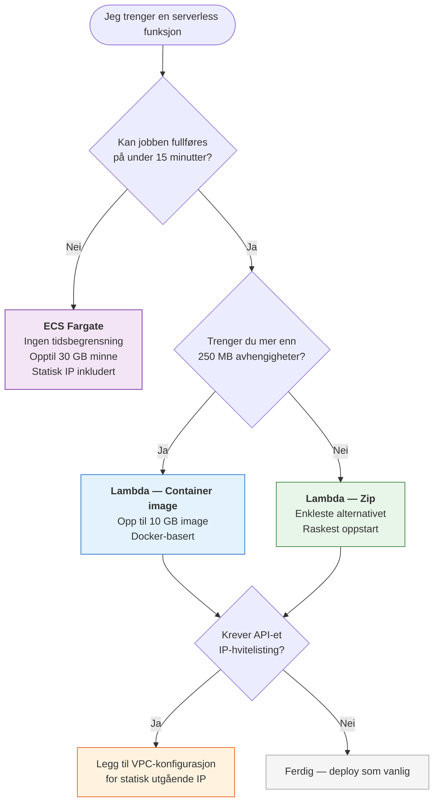
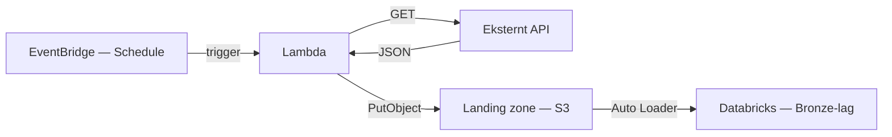
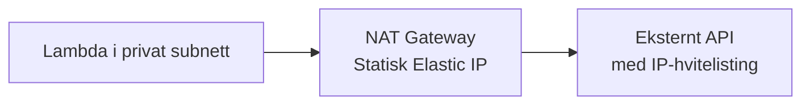

# Hente data via API

Denne guiden viser hvordan du setter opp en serverless funksjon som henter data fra et eksternt API og skriver det til [landing zone](laste-opp-til-landing-zone.md).

## Velg riktig løsning

Bruk beslutningstreet under for å velge riktig compute-type:



| Mønster | Maks kjøretid | Maks avhengigheter | Statisk IP | Bruksområde |
|---------|--------------|-------------------|------------|-------------|
| **Lambda — Zip** | 15 min | 250 MB | Valgfritt tillegg | Enkle API-kall, lette avhengigheter |
| **Lambda — Container image** | 15 min | 10 GB | Valgfritt tillegg | Tunge biblioteker (pandas, ML-modeller) |
| **ECS Fargate** | Ubegrenset | Ubegrenset | Alltid (kjører i VPC) | Langkjørende jobber, tung prosessering |

!!! tip "Velg det enkleste"
    Start med **Lambda — Zip** med mindre du har et konkret behov for et annet mønster. Du kan alltid migrere senere.

!!! info "Statisk IP"
    Alle serverless-funksjoner kan få statisk utgående IP-adresse. Fargate har det automatisk fordi det kjører i VPC med NAT Gateway. For Lambda legger du til en VPC-konfigurasjon — se [Legg til statisk IP](#legg-til-statisk-ip-lambda).

For en dypere forklaring av forskjellene, se [Serverless compute](../../om-plattformen/konsepter/serverless-compute.md). For tekniske detaljer om navnekonvensjoner og CI/CD, se [SAM-deploy](../../referanse/sam-deploy.md).

## Oversikt



## Forutsetninger

- Du har et workspace med en landing zone-sender konfigurert (se [Landing zone](../../referanse/landing-zone.md))
- Du har et workspace med OIDC konfigurert for ditt repo
- Du har SAM CLI installert lokalt (se [SAM-deploy — Verktøy](../../referanse/sam-deploy.md#verkty))

---

## Lambda — Zip (standard)

Bruk dette mønsteret når avhengighetene dine er under 250 MB og jobben fullføres på under 15 minutter.

### Steg 1 — Opprett mappestruktur

```
sam/my-api-collector/
├── template.yaml
└── src/
    ├── app.py
    └── requirements.txt
```

### Steg 2 — Skriv SAM-template

`template.yaml` definerer Lambda-funksjonen, IAM-rollen og miljøvariabler:

```yaml
AWSTemplateFormatVersion: "2010-09-09"
Transform: AWS::Serverless-2016-10-31
Description: >
  Lambda som henter data fra et API og skriver til landing zone.

Parameters:
  PermissionsBoundaryArn:
    Type: String
    Description: Permission boundary ARN (settes automatisk av deploy-workflowen)

Globals:
  Function:
    Timeout: 300
    Runtime: python3.12
    Architectures:
      - arm64

Resources:
  MyApiCollectorFunction:
    Type: AWS::Serverless::Function
    Properties:
      FunctionName: <workspace-name>_my-api-collector # (1)!
      CodeUri: src/
      Handler: app.lambda_handler
      Role: !GetAtt MyApiCollectorFunctionRole.Arn
      Environment:
        Variables:
          API_URL: "https://data.ssb.no/api/pxwebapi/v2/tables/13760/data?lang=no&outputFormat=json-stat2"
          S3_BUCKET: "<bucket-id>-<workspace-name>-landing-zone"
          S3_PREFIX: "ssb/green"

  MyApiCollectorFunctionRole:
    Type: AWS::IAM::Role
    Properties:
      RoleName: <workspace-name>-sam-my-api-collector-role # (2)!
      PermissionsBoundary: !Ref PermissionsBoundaryArn
      AssumeRolePolicyDocument:
        Version: "2012-10-17"
        Statement:
          - Effect: Allow
            Principal:
              Service: lambda.amazonaws.com
            Action: sts:AssumeRole
      ManagedPolicyArns:
        - arn:aws:iam::aws:policy/service-role/AWSLambdaBasicExecutionRole
      Policies:
        - PolicyName: LandingZoneWriteAccess
          PolicyDocument:
            Version: "2012-10-17"
            Statement:
              - Effect: Allow
                Action:
                  - s3:PutObject
                Resource:
                  - "arn:aws:s3:::<bucket-id>-<workspace-name>-landing-zone/ssb/green/*"
```

1. Funksjonsnavn **må** starte med `<workspace-name>_` eller `<workspace-name>-`
2. Rollenavn **må** starte med `<workspace-name>-sam-` eller `<workspace-name>_sam-`

!!! warning "Navnekonvensjoner"
    Funksjons- og rollenavn har strenge prefikskrav. Både `-` og `_` støttes som separator etter workspace-navnet, men prefikset må matche. Se [SAM-deploy — Navnekonvensjoner](../../referanse/sam-deploy.md#navnekonvensjoner) for detaljer.

### Steg 3 — Skriv Lambda-handleren

Lambda-handleren henter data fra API-et og skriver det til S3 organisert etter dato, slik at Auto Loader enkelt kan plukke opp nye filer:

```python
import json
import os
from datetime import datetime, timezone

import boto3
import urllib3


def fetch_api_data(url: str) -> dict:
    """Fetch data from an external API."""
    http = urllib3.PoolManager()
    response = http.request("GET", url, timeout=60)

    if response.status != 200:
        raise RuntimeError(f"API returned status {response.status}")

    return json.loads(response.data.decode("utf-8"))


def write_to_landing_zone(data: dict, bucket: str, prefix: str) -> str:
    """Write JSON data to S3, organized by date."""
    now = datetime.now(timezone.utc)
    date_path = now.strftime("%Y/%m/%d")
    timestamp = now.strftime("%Y%m%dT%H%M%SZ")
    key = f"{prefix}/{date_path}/data-{timestamp}.json"

    s3 = boto3.client("s3")
    s3.put_object(
        Bucket=bucket,
        Key=key,
        Body=json.dumps(data, ensure_ascii=False).encode("utf-8"),
        ContentType="application/json",
    )

    return f"s3://{bucket}/{key}"


def lambda_handler(event, context):
    url = os.environ["API_URL"]
    bucket = os.environ["S3_BUCKET"]
    prefix = os.environ["S3_PREFIX"]

    data = fetch_api_data(url)
    s3_path = write_to_landing_zone(data, bucket, prefix)

    return {"statusCode": 200, "body": {"s3_path": s3_path}}
```

!!! info "Ingen ekstra avhengigheter"
    `boto3` og `urllib3` er inkludert i Lambda-runtimen. Du trenger ikke legge dem til i `requirements.txt`. Trenger du `requests` eller andre biblioteker, legg dem til i `requirements.txt` så vil SAM pakke dem inn automatisk.

### Steg 4 — Test lokalt

```bash
cd sam/my-api-collector
sam build
sam local invoke MyApiCollectorFunction
```

### Steg 5 — Deploy

Deploy skjer automatisk via GitHub Actions dersom det er satt opp. En eksempel-workflow i padda-databrikker-repoet viser hvordan det kan settes opp. Se [SAM-deploy — CI/CD-pipeline](../../referanse/sam-deploy.md#cicd-pipeline) for detaljer.

### Steg 6 — Sett opp en schedule (valgfritt)

For å kjøre Lambdaen automatisk kan du legge til en `Events`-seksjon i `template.yaml`:

```yaml
  MyApiCollectorFunction:
    Type: AWS::Serverless::Function
    Properties:
      # ... eksisterende konfigurasjon ...
      Events:
        DailySchedule:
          Type: Schedule
          Properties:
            Schedule: cron(0 6 * * ? *)   # Hver dag kl. 06:00 UTC
            Description: Hent ferske data fra API daglig
```

### Steg 7 — Les data i Databricks

Når dataen ligger i landing zone kan du lese den med Auto Loader i en Databricks-notebook eller som en jobb:

```python
df = (
    spark.readStream
    .format("cloudFiles")
    .option("cloudFiles.format", "json")
    .option("cloudFiles.schemaLocation", "/tmp/schema/ssb")
    .load("s3://<bucket-id>-<workspace-name>-landing-zone/ssb/green/")
)
```

!!! info "Tips"
    Se [Landing zone](../../referanse/landing-zone.md) for mer om filformater og Auto Loader.

---

## Lambda — Container image

Bruk dette mønsteret når avhengighetene dine overskrider 250 MB zip-grensen (f.eks. pandas, numpy, ML-modeller).

### Steg 1 — Opprett mappestruktur

```
sam/my-container-function/
├── template.yaml
└── src/
    ├── app.py
    ├── Dockerfile
    └── requirements.txt
```

### Steg 2 — Skriv Dockerfile

Bruk det offisielle AWS Lambda Python-imaget som base:

```dockerfile
FROM public.ecr.aws/lambda/python:3.13

# Install dependencies
COPY requirements.txt ${LAMBDA_TASK_ROOT}/
RUN pip install --no-cache-dir -r ${LAMBDA_TASK_ROOT}/requirements.txt

# Copy function code
COPY app.py ${LAMBDA_TASK_ROOT}/

# Set the handler
CMD ["app.lambda_handler"]
```

### Steg 3 — Skriv SAM-template

Den viktigste forskjellen fra zip-varianten er `PackageType: Image` og `Metadata`-blokken som peker SAM til Dockerfilen:

```yaml
AWSTemplateFormatVersion: "2010-09-09"
Transform: AWS::Serverless-2016-10-31
Description: >
  Container-basert Lambda-funksjon deployet fra ECR.

Parameters:
  PermissionsBoundaryArn:
    Type: String
    Description: Permission boundary ARN (settes automatisk av deploy-workflowen)

Globals:
  Function:
    Timeout: 300

Resources:
  MyContainerFunction:
    Type: AWS::Serverless::Function
    Properties:
      FunctionName: <workspace-name>_my-container-function
      PackageType: Image # (1)!
      Role: !GetAtt MyContainerFunctionRole.Arn
      Environment:
        Variables:
          LOG_LEVEL: INFO
    Metadata: # (2)!
      DockerTag: latest
      DockerContext: ./src
      Dockerfile: Dockerfile

  MyContainerFunctionRole:
    Type: AWS::IAM::Role
    Properties:
      RoleName: <workspace-name>-sam-my-container-function-role
      PermissionsBoundary: !Ref PermissionsBoundaryArn
      AssumeRolePolicyDocument:
        Version: "2012-10-17"
        Statement:
          - Effect: Allow
            Principal:
              Service: lambda.amazonaws.com
            Action: sts:AssumeRole
      ManagedPolicyArns:
        - arn:aws:iam::aws:policy/service-role/AWSLambdaBasicExecutionRole
```

1. `Image` i stedet for standard `Zip` — dette forteller SAM at funksjonen er Docker-basert
2. `Metadata`-blokken peker SAM til Dockerfile-lokasjonen

### Steg 4 — Skriv Lambda-handleren

Lambda-handleren er identisk med zip-varianten. Koden i `app.py` er den samme — bare pakkeformatet er annerledes.

### Steg 5 — Test og deploy

```bash
cd sam/my-container-function
sam build
sam local invoke MyContainerFunction
```

Deploy fungerer automatisk via samme CI/CD-pipeline. SAM bygger Docker-imaget og pusher det til ECR.

---

## ECS Fargate

Bruk dette mønsteret for jobber som trenger mer enn 15 minutters kjøretid, mer minne (opptil 30 GB), eller mer CPU enn Lambda tilbyr.

!!! info "Statisk IP inkludert"
    Fargate-tasks kjører alltid i VPC-ens private ECS-subnett. All utgående trafikk rutes gjennom NAT Gateway med en fast Elastic IP. Du trenger ikke gjøre noe ekstra for å få statisk IP.

!!! warning "Mer kompleksitet"
    Fargate krever flere ressurser i SAM-templaten (cluster, task definition, roller). Bruk kun dette mønsteret når Lambda ikke dekker behovet.

### Steg 1 — Opprett mappestruktur

```
sam/my-fargate-task/
├── template.yaml
└── src/
    ├── app.py
    ├── Dockerfile
    └── requirements.txt
```

### Steg 2 — Skriv Dockerfile

Fargate bruker et standard Python-image (ikke Lambda-imaget):

```dockerfile
FROM python:3.13-slim

WORKDIR /app

COPY requirements.txt .
RUN pip install --no-cache-dir -r requirements.txt

COPY app.py .

CMD ["python", "app.py"]
```

!!! info "Forskjell fra Lambda-container"
    Lambda-containers bruker `public.ecr.aws/lambda/python:*` og har en handler. Fargate bruker et standard Python-image og kjører `app.py` som et vanlig script.

### Steg 3 — Skriv applikasjonen

I motsetning til Lambda har Fargate ingen handler — applikasjonen kjører som et vanlig Python-script:

```python
import json
import logging
import os
from datetime import datetime, timezone

import boto3
import requests

logger = logging.getLogger()
logger.setLevel(os.environ.get("LOG_LEVEL", "INFO"))


def main():
    """Main entry point for the Fargate task."""
    logger.info("Fargate task started")

    # Fetch data from API
    response = requests.get("https://example.com/api/data", timeout=60)
    response.raise_for_status()
    data = response.json()

    # Write to landing zone
    now = datetime.now(timezone.utc)
    key = f"my-prefix/green/{now:%Y/%m/%d}/data-{now:%Y%m%dT%H%M%SZ}.json"

    s3 = boto3.client("s3")
    s3.put_object(
        Bucket=os.environ["S3_BUCKET"],
        Key=key,
        Body=json.dumps(data, ensure_ascii=False).encode("utf-8"),
        ContentType="application/json",
    )

    logger.info(f"Wrote data to s3://{os.environ['S3_BUCKET']}/{key}")


if __name__ == "__main__":
    logging.basicConfig()
    main()
```

### Steg 4 — Skriv SAM-template

Fargate-templaten er mer omfattende. Den definerer et ECS-cluster, en task definition, IAM-roller og en EventBridge-schedule:

```yaml
AWSTemplateFormatVersion: "2010-09-09"
Transform: AWS::Serverless-2016-10-31
Description: >
  Fargate-basert task for langkjørende jobber.

Parameters:
  PermissionsBoundaryArn:
    Type: String
    Description: Permission boundary ARN (settes automatisk av deploy-workflowen)
  SubnetIds:
    Type: AWS::SSM::Parameter::Value<String>
    Default: /<workspace-name>/sam/vpc/ecs-subnet-ids # (1)!

Resources:
  FargateCluster:
    Type: AWS::ECS::Cluster
    Properties:
      ClusterName: <workspace-name>-fargate-cluster
      CapacityProviders:
        - FARGATE
      DefaultCapacityProviderStrategy:
        - CapacityProvider: FARGATE
          Weight: 1
      ClusterSettings:
        - Name: containerInsights
          Value: enabled

  FargateTaskDefinition:
    Type: AWS::ECS::TaskDefinition
    Properties:
      Family: <workspace-name>-fargate-task
      NetworkMode: awsvpc
      RequiresCompatibilities:
        - FARGATE
      Cpu: "256"    # 0.25 vCPU
      Memory: "512"  # 0.5 GB
      ExecutionRoleArn: !GetAtt TaskExecutionRole.Arn
      TaskRoleArn: !GetAtt TaskRole.Arn
      ContainerDefinitions:
        - Name: fargate-container
          Image: !Sub "${AWS::AccountId}.dkr.ecr.${AWS::Region}.amazonaws.com/<workspace-name>-sam:my-fargate-task"
          Essential: true
          Environment:
            - Name: LOG_LEVEL
              Value: INFO
            - Name: S3_BUCKET
              Value: <bucket-id>-<workspace-name>-landing-zone
          LogConfiguration:
            LogDriver: awslogs
            Options:
              awslogs-group: !Ref LogGroup
              awslogs-region: !Ref AWS::Region
              awslogs-stream-prefix: fargate

  LogGroup:
    Type: AWS::Logs::LogGroup
    Properties:
      LogGroupName: /aws/ecs/<workspace-name>_fargate
      RetentionInDays: 7

  # Rolle for å hente images og skrive logger
  TaskExecutionRole:
    Type: AWS::IAM::Role
    Properties:
      RoleName: <workspace-name>-sam-fargate-execution-role
      PermissionsBoundary: !Ref PermissionsBoundaryArn
      AssumeRolePolicyDocument:
        Version: "2012-10-17"
        Statement:
          - Effect: Allow
            Principal:
              Service: ecs-tasks.amazonaws.com
            Action: sts:AssumeRole
      ManagedPolicyArns:
        - arn:aws:iam::aws:policy/service-role/AmazonECSTaskExecutionRolePolicy

  # Rolle for applikasjonens tilganger (S3, SSM osv.)
  TaskRole:
    Type: AWS::IAM::Role
    Properties:
      RoleName: <workspace-name>-sam-fargate-task-role
      PermissionsBoundary: !Ref PermissionsBoundaryArn
      AssumeRolePolicyDocument:
        Version: "2012-10-17"
        Statement:
          - Effect: Allow
            Principal:
              Service: ecs-tasks.amazonaws.com
            Action: sts:AssumeRole
      Policies:
        - PolicyName: S3Write
          PolicyDocument:
            Version: "2012-10-17"
            Statement:
              - Effect: Allow
                Action:
                  - s3:PutObject
                  - s3:GetObject
                  - s3:ListBucket
                Resource:
                  - arn:aws:s3:::<bucket-id>-<workspace-name>-landing-zone/*
                  - arn:aws:s3:::<bucket-id>-<workspace-name>-landing-zone

  # EventBridge-rolle for å trigge ECS-tasks
  EventBridgeRole:
    Type: AWS::IAM::Role
    Properties:
      RoleName: <workspace-name>-sam-fargate-eventbridge-role
      PermissionsBoundary: !Ref PermissionsBoundaryArn
      AssumeRolePolicyDocument:
        Version: "2012-10-17"
        Statement:
          - Effect: Allow
            Principal:
              Service: events.amazonaws.com
            Action: sts:AssumeRole
      Policies:
        - PolicyName: RunFargateTaskPolicy
          PolicyDocument:
            Version: "2012-10-17"
            Statement:
              - Effect: Allow
                Action: ecs:RunTask
                Resource: !Ref FargateTaskDefinition
              - Effect: Allow
                Action: iam:PassRole
                Resource:
                  - !GetAtt TaskExecutionRole.Arn
                  - !GetAtt TaskRole.Arn

  ScheduledTaskRule:
    Type: AWS::Events::Rule
    Properties:
      Name: <workspace-name>-fargate-schedule
      Description: Trigger Fargate-task på en tidsplan
      ScheduleExpression: "rate(1 day)"
      State: ENABLED
      Targets:
        - Arn: !GetAtt FargateCluster.Arn
          RoleArn: !GetAtt EventBridgeRole.Arn
          Id: FargateScheduledTask
          EcsParameters:
            TaskDefinitionArn: !Ref FargateTaskDefinition
            TaskCount: 1
            LaunchType: FARGATE
            PlatformVersion: LATEST
            NetworkConfiguration:
              AwsVpcConfiguration:
                Subnets: !Split [",", !Ref SubnetIds]
                AssignPublicIp: DISABLED
```

1. ECS-subnett-IDene er provisjonert av Terraform (`padda-iac`) og lagret i SSM Parameter Store. Disse subnettene ruter trafikk gjennom NAT Gateway automatisk.

!!! info "Fargate-roller"
    Fargate trenger tre roller: **TaskExecutionRole** (for å hente images og skrive logger), **TaskRole** (for applikasjonens tilganger, f.eks. S3), og **EventBridgeRole** (for å trigge tasken). Se [Serverless compute — Fargate-roller](../../om-plattformen/konsepter/serverless-compute.md#fargate-roller) for forklaring.

### Steg 5 — Deploy

CI/CD-pipelinen oppdager Fargate-mapper automatisk, bygger Docker-imaget, pusher til ECR, og deployer via SAM. Se [SAM-deploy — CI/CD-pipeline](../../referanse/sam-deploy.md#cicd-pipeline).

---

## Legg til statisk IP (Lambda)

Hvis det eksterne API-et krever IP-hvitelisting kan du plassere Lambda-funksjonen i VPC-en. Dette gjelder både zip- og container-varianten. All utgående trafikk rutes da gjennom NAT Gateway med en fast Elastic IP.

!!! info "Gjelder bare Lambda"
    Fargate kjører allerede i VPC med statisk IP — du trenger ikke gjøre noe ekstra der.

### Slik fungerer det



1. Plattformteamet har provisjonert en delt VPC med private subnett og NAT Gateway via Terraform (`padda-iac`)
2. Subnett-IDer og sikkerhetsgruppe-ID er lagret i SSM Parameter Store
3. Du refererer til disse i SAM-templaten — Lambda plasseres i de private subnettene
4. All utgående trafikk fra Lambdaen går gjennom NAT Gateway med fast IP

### Legg til VPC-konfigurasjon i template.yaml

Legg til SSM-parametere og `VpcConfig` i den eksisterende templaten din:

```yaml
Parameters:
  PermissionsBoundaryArn:
    Type: String
    Description: Permission boundary ARN (settes automatisk av deploy-workflowen)

  # Legg til disse to parameterne:
  LambdaSubnetIdsCsv:
    Type: AWS::SSM::Parameter::Value<String>
    Default: /<workspace-name>/sam/vpc/lambda-subnet-ids # (1)!

  SecurityGroupId:
    Type: AWS::SSM::Parameter::Value<String>
    Default: /<workspace-name>/sam/vpc/security-group-id
```

1. Verdiene er provisjonert av Terraform og lagret i SSM automatisk. Du trenger bare referere til dem.

Legg til `VpcConfig` på funksjonen:

```yaml
  MyFunction:
    Type: AWS::Serverless::Function
    Properties:
      # ... eksisterende konfigurasjon ...
      VpcConfig: # (1)!
        SubnetIds: !Split [",", !Ref LambdaSubnetIdsCsv]
        SecurityGroupIds:
          - !Ref SecurityGroupId
```

1. `VpcConfig` plasserer Lambdaen i private subnett — all utgående trafikk går via NAT Gateway.

Legg til VPC-tilgang på IAM-rollen:

```yaml
  MyFunctionRole:
    Type: AWS::IAM::Role
    Properties:
      # ... eksisterende konfigurasjon ...
      ManagedPolicyArns:
        - arn:aws:iam::aws:policy/service-role/AWSLambdaBasicExecutionRole
        - arn:aws:iam::aws:policy/service-role/AWSLambdaVPCAccessExecutionRole # (1)!
```

1. Påkrevd for at Lambda skal kunne opprette nettverksgrensesnitt (ENI) i VPC-en.

!!! warning "Cold start-latens"
    Lambda i VPC har 1–2 sekunder ekstra cold start fordi den må opprette et nettverksgrensesnitt. For funksjoner som trigges sjeldent kan dette merkes.

!!! info "Lokal testing"
    VPC-konfigurasjonen gjelder kun i AWS. Lokalt (`sam local invoke`) har funksjonen normal nettverkstilgang.

---

## Bruke secrets i Lambda

Hemmeligheter (API-nøkler, tokens, passord) skal aldri legges direkte i `template.yaml`. Bruk SSM Parameter Store i stedet. Se [Håndtere secrets](../utvikle-og-deploye/haandtere-secrets.md) for en komplett guide.

Kort oppsummert:

1. Legg hemmeligheten som en GitHub Environment secret med prefiks `SSM_`
2. Deploy-workflowen synkroniserer den automatisk til SSM Parameter Store
3. Lambdaen leser verdien ved kjøretid med `boto3`

```python
import boto3


def get_secret(param_name: str) -> str:
    ssm = boto3.client("ssm")
    response = ssm.get_parameter(Name=param_name, WithDecryption=True)
    return response["Parameter"]["Value"]
```
