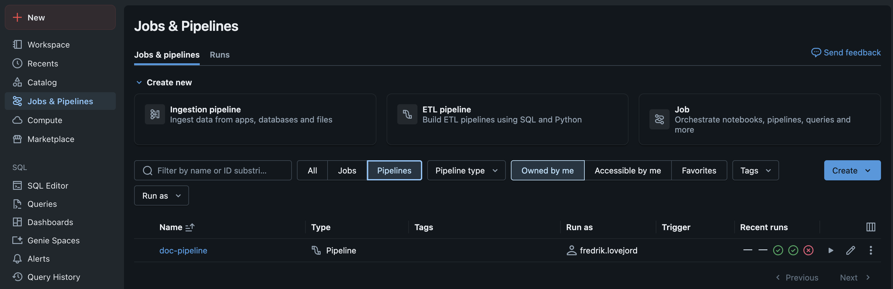
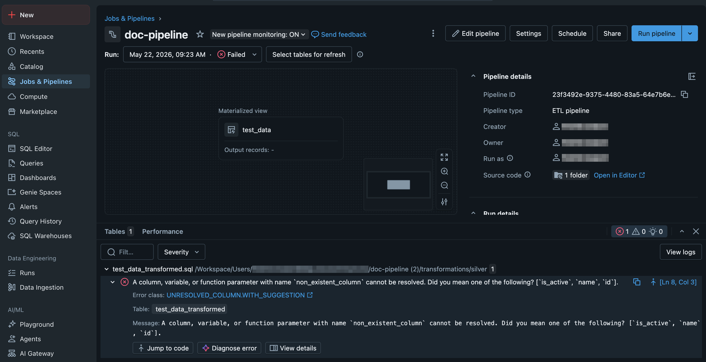
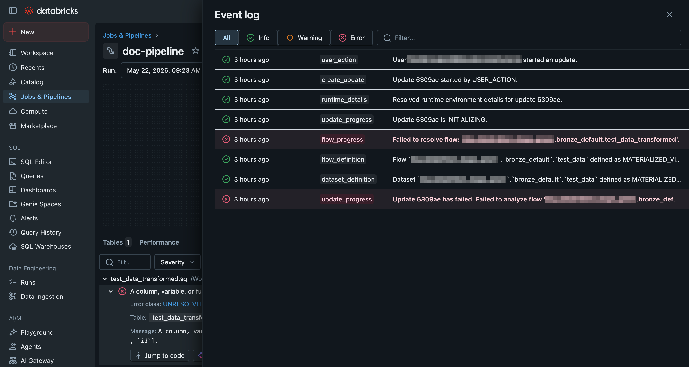
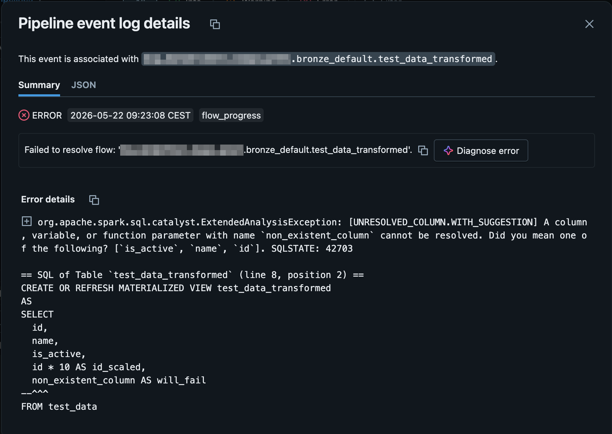

# Gjenopprette etter feil i pipelines

Denne veiledningen viser deg hvordan du finner ut hvorfor en pipeline feilet, kjører den på nytt på en trygg måte, og verifiserer at den er frisk igjen. Den dekker både forbigående feil, schema-endringer og fastlåste streaming-kjøringer.

## Før du begynner

Sørg for at du har:

- Tilgang til arbeidsområdet/workspacet der jobben kjørte (og rolle som lar deg starte og repare jobbkjøringer)
- Skrivetilgang til checkpoint- og schema-lokasjoner pipelinen bruker (bare nødvendig for trinn 3 og 4)
- [Databricks CLI](https://docs.databricks.com/aws/en/dev-tools/cli/) installert hvis du vil bruke CLI i stedet for UI

## Trinn 1: Finn ut hvorfor kjøringen feilet

Start alltid med å lese feilmeldingen fra den feilede kjøringen før du gjør noe annet. Mange feil er forbigående (kvotegrenser, nettverk, kort utilgjengelig kilde) og krever bare en omstart. Andre er reelle problemer som vil feile igjen på samme måte.

=== "UI"

    

    1. Åpne **Jobs & pipelines** i Databricks-arbeidsområdet.
    2. Velg den feilede jobben, og klikk på den siste røde task-symbolet :octicons-x-circle-fill-24:{ style="color: red" }.

    Inn i view for pipeline
    

    3. Klikk på "view logs"

    

    4. Trykk på feilende event og les log

    

=== "CLI"

    ```bash
    databricks pipelines list-pipelines --profile <din profil>
    databricks pipelines list-pipeline-events --filter "update_id = '<update-id>'" <pipeline_id> --profile <din profil>  | jq '.[] | select(.error.exceptions) | .error.exceptions'| jq -r '.[].message'
    ```

Se [Feilsøke med logger](logging.md) for hvordan du tolker vanlige feilmeldinger og graver dypere i logger.

!!! note
    Skriv ned hvilken task som feilet og hvilken fase (lese fra kilde, transformasjon, skriv til Unity Catalog). Det avgjør hvilket av de neste trinnene du trenger.

## Trinn 2: Kjør jobben på nytt etter en forbigående feil

Hvis feilen ser forbigående ut — typisk nettverksfeil, midlertidig utilgjengelig kilde, eller en kvote som har resatt seg — kan du kjøre jobben på nytt direkte. Bruk **Repair run** hvis bare enkelte tasks feilet; det starter bare de feilede taskene på nytt og bruker resultatene fra de som lyktes.

=== "UI"

    1. Åpne den feilede kjøringen.
    2. Klikk **Repair run** øverst til høyre.
    3. Velg hvilke tasks som skal kjøres på nytt (standard: alle feilede), og bekreft.

=== "CLI"

    ```bash
    databricks jobs repair-run <run-id> --rerun-all-failed-tasks
    ```

Hvis du må kjøre hele jobben fra start (for eksempel fordi inndata har endret seg):

```bash
databricks jobs run-now --job-id <job-id>
```

!!! warning
    Ikke gjenta **Repair run** mer enn én eller to ganger uten å undersøke. Hvis samme task feiler flere ganger på rad er det ikke en forbigående feil — gå videre til trinn 4 eller åpne logger på nytt.

## Trinn 3: Resett checkpoint når en streaming-jobb har låst seg

En streaming-pipeline kan låse seg hvis state-en i checkpointet ikke lenger stemmer med koden eller kilden — for eksempel etter at du har endret transformasjon, byttet kildesti, eller fjernet en kolonne som checkpointet refererer til. Symptomer er at jobben enten henger på `Initializing stream` eller feiler umiddelbart med en mismatch-feil knyttet til state eller offset.

!!! warning
    Å resette et checkpoint betyr at streamen starter på nytt fra den posisjonen kilden tilbyr (typisk fra første tilgjengelige fil i Auto Loader). Avhengig av hvordan måltabellen skrives kan dette gi duplikater. Verifiser at skrivingen er idempotent (for eksempel `MERGE` eller `foreachBatch` med deduplisering) før du fortsetter, eller tøm måltabellen som en del av resetten.

1. **Stopp streamen.** Avslutt den pågående kjøringen i Workflows-UI-et før du rører checkpoint-mappen.
2. **Fjern checkpoint-mappen.** Lokasjonen er angitt med `checkpointLocation` der streamen er definert (eller automatisk valgt av Declarative Pipelines). For en standard streaming write:

    ```python
    dbutils.fs.rm("/tmp/checkpoint/min-app", recurse=True)
    ```

3. **Vurder også schema-mappen.** Hvis pipelinen bruker Auto Loader med `cloudFiles.schemaLocation`, kan schema-state-en også være låst — se trinn 4.
4. **Start streamen på nytt** via Workflows-UI-et eller CLI som i trinn 2.

For Declarative Pipelines (DLT/LDP) ligger checkpoint-state inne i pipeline-storage-lokasjonen. Bruk **Full refresh** fra pipeline-UI-et i stedet for å slette filer manuelt — det er den støttede måten å rebuild-e fra start.

## Trinn 4: Håndter en schema-endring som bryter pipelinen

Hvis feilen skyldes at kildedata har fått en ny kolonne, en endret type, eller en fjernet kolonne, må du beslutte hvordan pipelinen skal forholde seg til endringen før du kjører på nytt.

Auto Loader styrer dette via `schemaEvolutionMode`. Se [Sette opp Auto Loader](../hente-inn-data/auto-loader.md) for hvilke moduser som er tilgjengelige og når hver passer.

Vanlige scenarier:

- **Ny kolonne i kilden, og du vil ha den med.** Bytt til `schemaEvolutionMode => 'addNewColumns'` (hvis du ikke allerede bruker det) og kjør jobben på nytt. Auto Loader oppdaterer schema-state-en automatisk ved første kjøring.
- **Ny kolonne, og du vil ignorere den.** Behold `failOnNewColumns` med eksplisitt `schema` slik at uventede kolonner blir oppdaget tidlig, men ikke endrer pipelinen.
- **Endret type eller fjernet kolonne.** Dette krever endring i transformasjonen. Oppdater koden, vurder om historisk data trenger full refresh, og kjør deretter på nytt.
- **Du har endret definisjonen av en streaming-tabell i en Declarative Pipeline.** Den nye definisjonen gjelder bare rader som leses inn etterpå. Skal den gjelde rader som allerede er lest inn, må tabellen få en full refresh: åpne pipelinen, klikk kjøreikonet ved tabelldefinisjonen og velg **Full refresh table**, eller kjør `databricks bundle run <pipeline> --full-refresh-all` for alle tabellene i pipelinen. Et materialisert view oppdateres alltid fra gjeldende definisjon og trenger ingen full refresh.
- **Du skal kjøre full refresh av en pipeline som inneholder bronze.** Da leses alt på nytt fra landing zone, se [Datainnlasting](../../om-plattformen/konsepter/datainnlasting.md#kan-vi-slette-filene-i-landing-zone-etter-innlasting).

Hvis schema-state-en er korrupt eller du har byttet evolusjonsmodus uten at det får effekt, slett `cloudFiles.schemaLocation` (samme prosedyre som checkpoint i trinn 3) og la Auto Loader bygge schemaet på nytt.

!!! warning
    Sletter du schema-lokasjonen mens en stream kjører får du udefinerte resultater. Stopp streamen først.

## Bekreft resultatet

Etter at jobben er startet på nytt, sjekk at den faktisk fullfører — ikke bare at den ikke har feilet enda.

=== "UI"

    1. Følg kjøringen i **Workflows → Runs** til den får status **Succeeded**.
    2. Åpne måltabellen i **Catalog** og bekreft at antallet rader har økt (eller stemmer med forventet inndata).

=== "CLI"

    ```bash
    databricks jobs get-run <run-id>
    ```

    Forventet utdata inkluderer:

    ```text
    "state": {
      "life_cycle_state": "TERMINATED",
      "result_state": "SUCCESS"
    }
    ```

For streaming-pipelines: la jobben kjøre én batch til etter resetten og bekreft at den ikke står fast i `Initializing` eller logger samme feil som før.

## Feilsøking

??? failure "Feilmelding: `Schema change detected`"
    Auto Loader oppdager at kilden har en ny eller endret kolonne, og er konfigurert til å feile. Velg en evolusjonsmodus som passer (trinn 4), eller oppdater eksplisitt `schema` om du bruker `failOnNewColumns`.

??? failure "Feilmelding: `Cannot find checkpoint` eller `Reservoir state mismatch`"
    Checkpointet stemmer ikke med koden eller kilden lenger. Følg trinn 3 for å resette det. Hvis pipelinen er en Declarative Pipeline, bruk **Full refresh** i stedet.

??? failure "Jobben henger på `Initializing stream` uten feilmelding"
    Streamen klarer ikke å initialisere state fra checkpointet. Stopp jobben i UI-et, og følg trinn 3.

??? failure "Endringa i pipeline-koden slår ikke inn på eksisterende rader"
    Tabellen er en streaming-tabell, og den nye definisjonen gjelder bare nye rader. Sjekk først at deployen gikk gjennom og at du kjørte pipelinen i samme target, og gi deretter tabellen en full refresh (trinn 4).

??? failure "Repair run kjører, men samme task feiler på nytt med samme feil"
    Det er ikke en forbigående feil. Gå tilbake til trinn 1 og les hele stack tracen, eller åpne driver logs via Spark UI.

## Relatert innhold

- [Feilsøke med logger](logging.md)
- [Sette opp Auto Loader](../hente-inn-data/auto-loader.md)
- [Sette opp Slack-alarmer](slack-alarmer.md)
- [Databricks Workflows — Repair and rerun](https://docs.databricks.com/aws/en/jobs/repair-job-failures)
