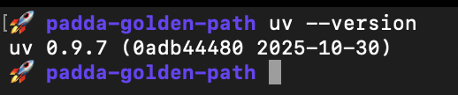

# Start her

Denne guiden beskriver hvordan du setter opp devmiljø og avhengigheter. Per idag er det mac og linux som er støttet, dersom du er på windows så er WSL en mulighet.

Guiden forutsetter at du har Homebrew installert, [Homebrew](https://brew.sh/)

# Installere uv
```bash
curl -LsSf https://astral.sh/uv/install.sh | sh
``` 

Sjekk med:

```bash
uv --version
``` 


# Git config
Det er satt opp en pre-commit-hook i padda-golden-path/.pre-commit-config.yaml som kjører ruff.

```bash
uvx pre-commit install
```

# Installere databricks-cli
```bash
brew tap databricks/tap
brew install databricks
``` 

TIP: For tab-completion følg instruksjoner fra Homebrew:

zsh:
```bash
echo fpath+=$(brew --prefix)/share/zsh/site-functions >> ~/.zshrc
echo 'autoload -Uz compinit && compinit' >> ~/.zshrc
zsh
``` 

Sjekk med:

```bash
databricks -v
``` 


## Konfigurere databricks-cli

Kjør igjennom guiden for konfigurasjon:
```bash
databricks configure
```
Verdier ligger i 1password, ta kontakt med dataspeilet dersom du ikke har tilgang.


# vscode spesifikke ting
Det er satt opp en settings.json og rekommenderte extensions i .vscode
