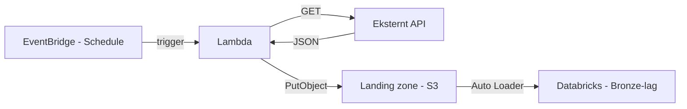

# Hente data fra API med Lambda

Denne guiden viser hvordan du bruker en kortlevd AWS Lambda-funksjon til å hente data fra et eksternt API og skrive det til [landing zone](../data/landing-zone.md).

## Oversikt



## Forutsetninger

- Du har et workspace med en landing zone-sender konfigurert (se [Landing zone](../data/landing-zone.md))
- Du har et workspace med oidc for repo.

## Steg 1 — Skriv SAM-template

`template.yaml` definerer Lambda-funksjonen, IAM-rollen og miljøvariabler. Her er et eksempel som henter data fra SSB:

```yaml
AWSTemplateFormatVersion: "2010-09-09"
Transform: AWS::Serverless-2016-10-31
Description: >
  Lambda som henter data fra et API og skriver til landing zone.

Parameters:
  PermissionsBoundaryArn:
    Type: String
    Description: Permission boundary ARN (settes automatisk av deploy-workflowen)

Globals:
  Function:
    Timeout: 300
    Runtime: python3.12
    Architectures:
      - arm64

Resources:
  MyApiCollectorFunction:
    Type: AWS::Serverless::Function
    Properties:
      # Må starte med <workspace-navn>_
      FunctionName: dig-databrikker-stage_my-api-collector
      CodeUri: src/
      Handler: app.lambda_handler
      Role: !GetAtt MyApiCollectorFunctionRole.Arn
      Environment:
        Variables:
          API_URL: "https://data.ssb.no/api/pxwebapi/v2/tables/13760/data?lang=no&outputFormat=json-stat2"
          S3_BUCKET: "5a3d7-dig-databrikker-stage-landing-zone"
          S3_PREFIX: "ssb/green"

  MyApiCollectorFunctionRole:
    Type: AWS::IAM::Role
    Properties:
      # Må starte med <workspace-navn>-sam-
      RoleName: dig-databrikker-stage-sam-my-api-collector-role
      PermissionsBoundary: !Ref PermissionsBoundaryArn
      AssumeRolePolicyDocument:
        Version: "2012-10-17"
        Statement:
          - Effect: Allow
            Principal:
              Service: lambda.amazonaws.com
            Action: sts:AssumeRole
      ManagedPolicyArns:
        - arn:aws:iam::aws:policy/service-role/AWSLambdaBasicExecutionRole
      Policies:
        - PolicyName: LandingZoneWriteAccess
          PolicyDocument:
            Version: "2012-10-17"
            Statement:
              - Effect: Allow
                Action:
                  - s3:PutObject
                Resource:
                  - "arn:aws:s3:::5a3d7-dig-databrikker-stage-landing-zone/ssb/green/*"
```

!!! warning "Navnekonvensjoner"
    Funksjonsnavn **må** starte med `<workspace-navn>_` og rollenavn **må** starte med `<workspace-navn>-sam-`. Uten dette vil deployen feile på grunn av permission boundary.

## Steg 3 — Skriv Lambda-handleren

Lambda-handleren henter data fra API-et og skriver det til S3 organisert etter dato, slik at Auto Loader enkelt kan plukke opp nye filer:

```python
import json
import os
from datetime import datetime, timezone

import boto3
import urllib3


def fetch_api_data(url: str) -> dict:
    """Hent data fra et eksternt API."""
    http = urllib3.PoolManager()
    response = http.request("GET", url, timeout=60)

    if response.status != 200:
        raise RuntimeError(f"API returned status {response.status}")

    return json.loads(response.data.decode("utf-8"))


def write_to_landing_zone(data: dict, bucket: str, prefix: str) -> str:
    """Skriv JSON-data til S3, organisert etter dato."""
    now = datetime.now(timezone.utc)
    date_path = now.strftime("%Y/%m/%d")
    timestamp = now.strftime("%Y%m%dT%H%M%SZ")
    key = f"{prefix}/{date_path}/data-{timestamp}.json"

    s3 = boto3.client("s3")
    s3.put_object(
        Bucket=bucket,
        Key=key,
        Body=json.dumps(data, ensure_ascii=False).encode("utf-8"),
        ContentType="application/json",
    )

    return f"s3://{bucket}/{key}"


def lambda_handler(event, context):
    url = os.environ["API_URL"]
    bucket = os.environ["S3_BUCKET"]
    prefix = os.environ["S3_PREFIX"]

    data = fetch_api_data(url)
    s3_path = write_to_landing_zone(data, bucket, prefix)

    return {"statusCode": 200, "body": {"s3_path": s3_path}}
```

!!! info "Ingen ekstra avhengigheter"
    `boto3` og `urllib3` er inkludert i Lambda-runtimen. Du trenger ikke legge dem til i `requirements.txt`. Trenger du `requests` eller andre biblioteker, legg dem til i `requirements.txt` så vil SAM pakke dem inn automatisk.

## Steg 4 — Deploy

Deploy skjer automatisk via GitHub Actions når du pusher til `stage`-branchen. Workflowen i padda-databrikker finner alle mapper under `sam/`, bygger og deployer hver enkelt som en separat CloudFormation-stack.

For å teste lokalt før du pusher:

```bash
cd sam/mitt-api-prosjekt
sam build
sam local invoke MyApiCollectorFunction
```

## Steg 5 — Sett opp en schedule (valgfritt)

For å kjøre Lambdaen automatisk kan du legge til en `Events`-seksjon i `template.yaml`:

```yaml
  MyApiCollectorFunction:
    Type: AWS::Serverless::Function
    Properties:
      # ... eksisterende konfigurasjon ...
      Events:
        DailySchedule:
          Type: Schedule
          Properties:
            Schedule: cron(0 6 * * ? *)   # Hver dag kl. 06:00 UTC
            Description: Hent ferske data fra API daglig
```

## Steg 6 — Les data i Databricks

Når dataen ligger i landing zone kan du lese den med Auto Loader i en Databricks-notebook eller som et job:

```python
df = (
    spark.readStream
    .format("cloudFiles")
    .option("cloudFiles.format", "json")
    .option("cloudFiles.schemaLocation", "/tmp/schema/ssb")
    .load("s3://5a3d7-dig-databrikker-stage-landing-zone/ssb/green/")
)
```
!!! info "Tips"
    Se [Landing zone](../data/landing-zone.md) for mer om filformater og Auto Loader.