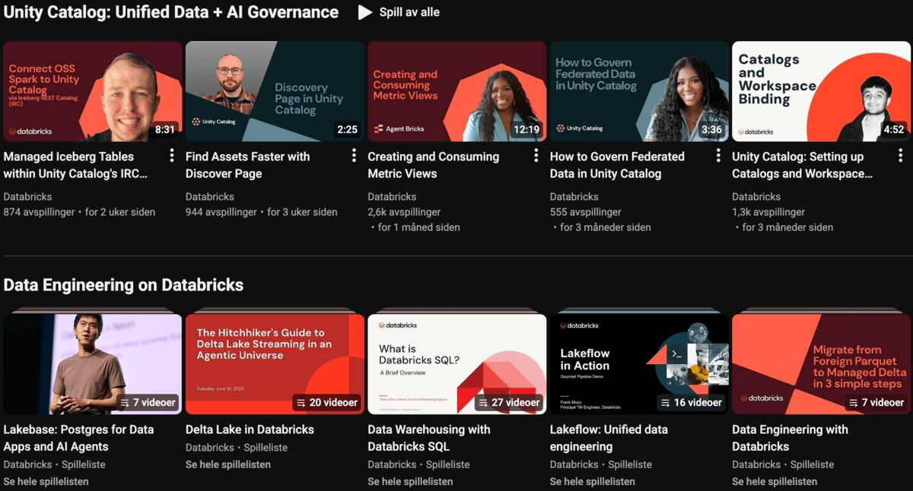

# Databricks-opplæring

Databricks har gode ressurser for å lære plattformen. Her er de viktigste startpunktene.

## Kom i gang

[Getting started](https://docs.databricks.com/aws/en/getting-started/) har praktiske tutorials som dekker de vanligste arbeidsflytene:

- **[Data exploration](https://docs.databricks.com/aws/en/getting-started/quick-start)** — spørre mot og visualisere data med notebooks og Unity Catalog
- **[Data engineering](https://docs.databricks.com/aws/en/getting-started/data-pipeline-get-started)** — bygge ETL-pipelines med Lakeflow Declarative Pipelines og Auto Loader
- **[AI and machine learning](https://docs.databricks.com/aws/en/getting-started/ml-get-started)** — trene modeller med scikit-learn og MLflow

## Videoer

[Databricks på YouTube](https://www.youtube.com/@Databricks) — den offisielle kanalen med keynotes, produktdemoer og tekniske gjennomganger.

## Kurs og sertifiseringer

[Databricks Academy](https://customer-academy.databricks.com/learn) er Databricks sin gratis læringsportal med selvstudium, kursløp og sertifiseringer. Du finner kurs tilpasset ulike roller — fra analytiker til data engineer.

## Utvalgt dokumentasjon

[Databricks-dokumentasjonen](https://docs.databricks.com/aws/en/) er omfattende. Disse seksjonene er spesielt relevante for arbeidet vi gjør på plattformen:

- **[Data Engineering](https://docs.databricks.com/aws/en/data-engineering/)** — ETL-pipelines, databehandling og orkestrering av arbeidsflyter med Lakeflow
- **[Data Governance](https://docs.databricks.com/aws/en/data-governance/)** — Unity Catalog, tilgangsstyring, datakvalitet og lineage
- **[AI/BI](https://docs.databricks.com/aws/en/ai-bi/)** — dashboards, rapporter og visualiseringer
- **[Developer Tools](https://docs.databricks.com/aws/en/dev-tools/)** — CLI, VS Code-utvidelse, Declarative Automation Bundles og SDK-er

## Verktøy for KI-assistert utvikling

Databricks tilbyr verktøy som lar KI-agenter som Claude Code og Cursor jobbe direkte mot Databricks-miljøer.

### AI Dev Kit

[Databricks AI Dev Kit](https://github.com/databricks-solutions/ai-dev-kit) er en offisiell verktøykasse fra Databricks med:

- **MCP-server** — gir KI-assistenter tilgang til over 50 Databricks-operasjoner (jobs, pipelines, dashboards, SQL og mer)
- **Skills** — ferdigskrevne kunnskapsfiler som lærer agenten Databricks-mønstre (Spark, Lakeflow, Bundles)
- Støtter Claude Code, Cursor, Windsurf og andre MCP-kompatible verktøy

### MCP on Databricks

[Model Context Protocol (MCP) on Databricks](https://docs.databricks.com/aws/en/generative-ai/mcp/) er Databricks sin offisielle MCP-dokumentasjon. Her finner du oppsett for managed MCP-servere som gir agenter tilgang til Unity Catalog, Vector Search og Genie — med innebygd tilgangsstyring.

### VS Code-utvidelsen

[Databricks for VS Code](https://marketplace.visualstudio.com/items?itemName=databricks.databricks) lar deg jobbe med Databricks direkte fra editoren — kjøre kode på clustre, synkronisere filer og deploye Bundles.
