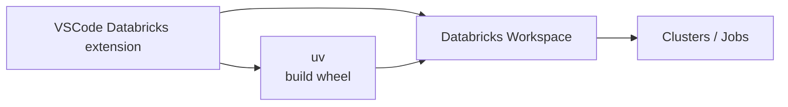

# VS Code + Databricks: fra notebooks til bundles

!!! info "Opprinnelse"
    Denne siden er sammenslått fra `docs/vscode-demo/1.md` til `docs/vscode-demo/4.md`.

- Utvikle Databricks-kode i **VS Code**
- Bruk **uv** til dependency management
- Pakk koden som **wheels**
- Deploy med **Databricks Bundles**
- Stol på Databricks-runtime for Spark-dependencies via `pip install --no-deps`

---

**Kontekst**

Denne demoen er en del av Padda Golden Path:

- Repository: `padda-golden-path`
- Fokus: `examples/vscode-demo` + Databricks bundles

## Oppsett og arkitektur

**Lokalt**

- VS Code
- Databricks VS Code extension
- `uv` for Python-deps og wheels
- Eksempelprosjekt: `examples/vscode-demo`

**Remote (Databricks)**

- Workspace (notebooks, filer, jobs)
- Clusters / serverless compute



Mål for demoen

Vis hele flyten fra å redigere `examples/vscode-demo` i VS Code
→ kjøre på Databricks
→ pakke som wheel
→ deploye med bundle
→ og kjøre i isolated mode

## Databricks VS Code Extension

**Installering**

1. Åpne **Extensions**-panelet i VS Code
2. Søk etter **"Databricks"**
3. Installer den **offisielle Databricks**-utvidelsen (se også [Databricks-opplæring](../hjelp/databricks-opplaering.md#vs-code-utvidelsen))

**Koble til workspace**

- Åpne Databricks-panelet i VS Code
- Klikk **Sign in / Configure connection**
- Konfigurer:
  - Workspace URL
  - Autentisering
- Verifiser:
  - At du ser **Workspace**, **Clusters**, **Jobs** i sidepanelet

## Opprett prosjekt og synk

**Demo repo-struktur**

```text
examples/
  vscode-demo/
    pyproject.toml
    src/vscode_demo/...
    notebooks/...
```
