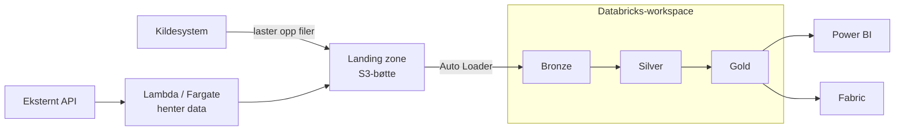

# Arkitektur

Plattformen er bygget på Databricks og kjører i AWS. Denne siden gir det overordnede
bildet: hvordan data kommer inn, hvor den lagres og styres, hvordan den deles videre, og
begrunnelsen for de viktigste valgene. Målet er at du skal forstå hvorfor plattformen ser
ut som den gjør, slik at resten av dokumentasjonen gir mer mening.

## Det store bildet

Arkitekturen har tre hoveddeler:

- **Inngang**: data kommer inn via en landing zone i S3, enten ved at kildesystemer laster
  opp filer selv, eller ved at tjenester i AWS henter data fra eksterne API-er.

- **Bearbeiding og lagring**: hvert team har isolerte Databricks-workspaces der data
  transformeres gjennom medaljonglagene og lagres i Unity Catalog.

- **Deling**: ferdige dataprodukter gjøres tilgjengelige for analyse og rapportering, for
  eksempel via Power BI.

Alle team får den samme grunnstrukturen: workspaces, kataloger og landing zone settes opp
likt av Dataspeilet. Det gjør at dokumentasjon, kodeeksempler og erfaringer kan deles på
tvers av team — det som fungerer for ett team, fungerer for alle.

## Data inn: landing zone

Hovedveien inn i plattformen er en **[landing zone](../../referanse/landing-zone.md)** —
en S3-bøtte som hører til workspacet. Kildesystemer får en egen «sender» med rettigheter
til å laste opp filer, adskilt i prefikser etter konfidensialitetsnivå (`green`, `yellow`,
`red`).

Landing zone er et bevisst enkelt grensesnitt. Et kildesystem trenger ikke vite noe om
Databricks, kataloger eller tabeller — det trenger bare å kunne skrive filer til S3. Det
gjør terskelen lav for å koble på nye kilder, og det frikobler kildesystemene fra det som
skjer videre i plattformen. Konfidensialitetsnivået skilles dessuten allerede fra første
steg, før data i det hele tatt har nådd Databricks.

Fra landing zone leses filene inn i bronze-laget, typisk med [Auto
Loader](../../guider/hente-inn-data/auto-loader.md), som holder styr på hvilke filer som
allerede er prosessert.

Ikke alle data trenger å gå denne veien. Mindre datasett som lastes opp manuelt, for
eksempel en Excel-fil, kan legges rett på en Unity Catalog Volume — se [Importere Excel
til Unity Catalog](../../guider/hente-inn-data/importere-excel-til-uc.md).

### Når plattformen må hente data selv

Databricks kan ikke selv nå ut til eksterne API-er. For kilder som må *hentes* i stedet
for å *levere*, bruker plattformen serverless-tjenester i AWS som henter data og skriver
til landing zone. Derfra følger data nøyaktig samme vei som filbaserte leveranser. Det er
et poeng i seg selv: uansett hvordan data kommer inn, er flyten videre den samme. Se
[Serverless compute](serverless-compute.md) for hvordan dette fungerer og når du bør velge
hva, og [Hente data via API](../../guider/hente-inn-data/hente-data-via-api.md) for
hvordan du setter opp en slik innhenting.

## Bearbeiding: ett workspace per team og miljø

Teamene på plattformen deler ikke arbeidsflate. Hvert team får egne Databricks-workspaces,
ett per miljø — **sandbox**, **stage** og **prod** — etter hva teamet trenger. Sandbox er
ment for utprøving av funksjonalitet, stage for utvikling og testing av pipelines, og prod
for produksjonskjøringer.

Workspacet er plattformens enhet for isolasjon. Det har sin egen landing zone, sine egne
kataloger og sin egen compute. Feil, eksperimenter og tilgangsbeslutninger i ett team
påvirker ikke andre team. Prisen er at deling av data på tvers av workspaces krever et
bevisst steg — det er ikke slik at alle ser alt.

Inne i workspacet beveger data seg gjennom medaljonglagene bronze, silver og gold — fra rå
kopi av kildedata til forretningsklare dataprodukter. Hvorfor plattformen bruker denne
lagdelingen, og hva hvert lag representerer, er forklart i [Klassifisering av
datakvalitet](klassifisering-datakvalitet.md).

## Lagring og styring: Unity Catalog

All data i plattformen lagres som tabeller i **[Unity
Catalog](https://docs.databricks.com/aws/en/data-governance/unity-catalog/)**, Databricks
sitt innebygde lag for styring av data. Unity Catalog organiserer data i et hierarki av
kataloger, skjemaer og tabeller, og det er her tilgang, eierskap og sporbarhet håndteres.

Hvert workspace får kataloger inndelt etter konfidensialitetsnivå — en for `green`, en for
`yellow` og en for `red` — med navn som kombinerer team, miljø og farge, for eksempel
`dig_felles_dev_green`.

Inndelingen etter konfidensialitetsnivå er et arkitekturvalg:
[sensitivitetsklassifiseringen](klassifisering-sensitivitet.md) avgjør hvilken katalog
data hører hjemme i, og tilgang kan dermed styres på katalognivå med grove, robuste
skiller — i stedet for å vedlikeholde finmaskede regler per tabell. Pålogging og identitet
håndteres gjennom Oslo kommunes Entra ID, så tilgang følger kommunebrukeren din — se [Slik
får du tilgang](../../kom-i-gang/slik-faar-du-tilgang.md). Hva de ulike rollene kan gjøre,
står i [Roller og rettigheter](../../referanse/roller-og-rettigheter.md).

## Deploy og drift: delt ansvar

Arkitekturen skiller mellom det teamene eier og det Dataspeilet eier:

- **Teamene** eier koden sin: notebooks, pipelines, jobbdefinisjoner og team-spesifikke
  ressurser. Alt ligger i Git og deployes med [Declarative Automation
  Bundles](databricks-bundles.md) — lokalt mot stage, og via CI/CD med service principals
  mot prod.

- **Dataspeilet** eier plattformressursene: workspaces, kataloger, landing zones og
  nettverk.

Skillet gjør teamene selvbetjente på det som endres ofte (koden), mens det som deles på
tvers og må være likt for alle (plattformressursene) forvaltes ett sted. Se
[Ansvarsfordeling mellom bundles og
padda-iac](../../referanse/databricks-bundles.md#ansvarsfordeling-mellom-bundles-og-padda-iac)
for detaljene.

## Data ut: dataprodukter til analyse og deling

Sluttmålet for det meste som bygges på plattformen er [dataprodukter](dataprodukter.md) —
dokumenterte, forvaltede datasett i gold-laget. Disse konsumeres typisk gjennom:

- **Power BI**, som kobler seg til plattformen via SQL Warehouse — se [Koble Power BI til
  Databricks](../../guider/dele-og-hente-ut/koble-til-power-bi.md)

- **Fabric-plattformen**, [kommunens plattform for datadeling](https://oslokommune.sharepoint.com/sites/KOM-6aace/SitePages/Data-Oslo(1).aspx)
  — data kan flyte begge veier mellom plattformene

## Avveininger og begrensninger

Arkitekturen prioriterer noen hensyn på bekostning av andre:

- **Standardisering som utgangspunkt.** Alle team får samme struktur, samme
  kataloginndeling og samme deploymønster ut av boksen. Det gjør plattformen forutsigbar
  og lett å dokumentere, samtidig som team kan velge å avvike fra strukturen der de har
  behov for det.

- **Sikkerhet fremfor bekvemmelighet.** Databricks-clusterne kjører i et isolert nettverk
  uten internettilgang. Det reduserer angrepsflaten, men betyr blant annet at
  Python-avhengigheter må [pakkes og deployes eksplisitt](databricks-bundles.md#wheels) i
  stedet for å installeres fra internett, og at all henting av eksterne data må gå omveien
  via AWS Lambda eller Fargate.

- **Filbasert batch fremfor sanntid.** Landing zone er filorientert, og data går gjennom
  flere lag før den er klar til bruk. For analytiske formål er forsinkelsen sjelden et
  problem, men plattformen er ikke bygget for sanntidsstrømmer mot sluttbrukere.

- **Selvbetjening har en grense.** Teamene er selvbetjente på kode og deploy, men
  plattformressurser som nye workspaces, kataloger og [landing
  zone-sendere](../../guider/hente-inn-data/laste-opp-til-landing-zone.md#be-om-en-sender)
  må settes opp av Dataspeilet. Det sikrer at oppsettet blir likt for alle team, men betyr
  at noen endringer kan innebære ventetid.

## Relatert innhold

**Forklaringer:**

- [Klassifisering av datakvalitet](klassifisering-datakvalitet.md) — hvorfor data beveger
  seg gjennom bronze, silver og gold
- [Serverless compute](serverless-compute.md) — Lambda og Fargate for datainnhenting
- [Declarative Automation Bundles](databricks-bundles.md) — hvorfor deploy skjer med
  bundles
- [Velg riktig dataplattform](../overordnet/velg-riktig-plattform.md) — Databricks eller
  Fabric?

**Guider:**

- [Laste opp filer til landing zone](../../guider/hente-inn-data/laste-opp-til-landing-zone.md)
- [Sette opp Auto Loader](../../guider/hente-inn-data/auto-loader.md)

**Referanser:**

- [Landing zone](../../referanse/landing-zone.md) — bøttestruktur, sendere og
  autentisering
- [Roller og rettigheter](../../referanse/roller-og-rettigheter.md)

**Kom i gang:**

- [Bygg din første datapipeline](../../kom-i-gang/din-forste-datapipeline.md) — hele
  flyten i praksis
