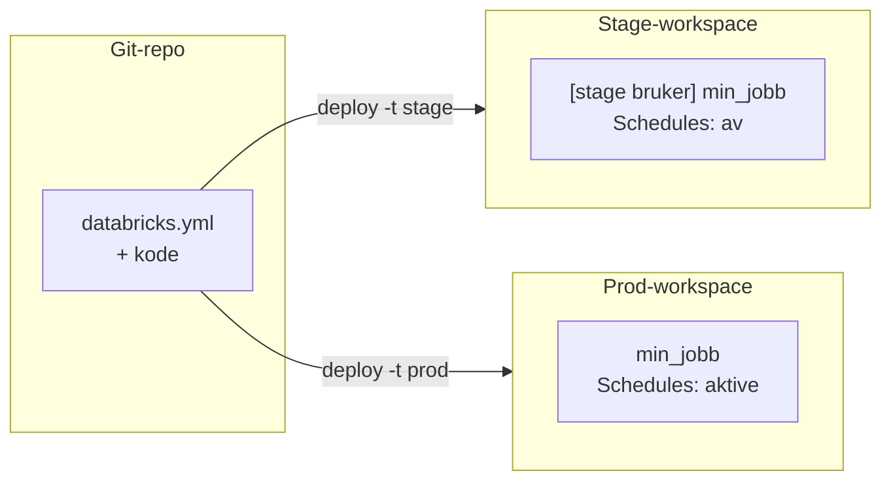
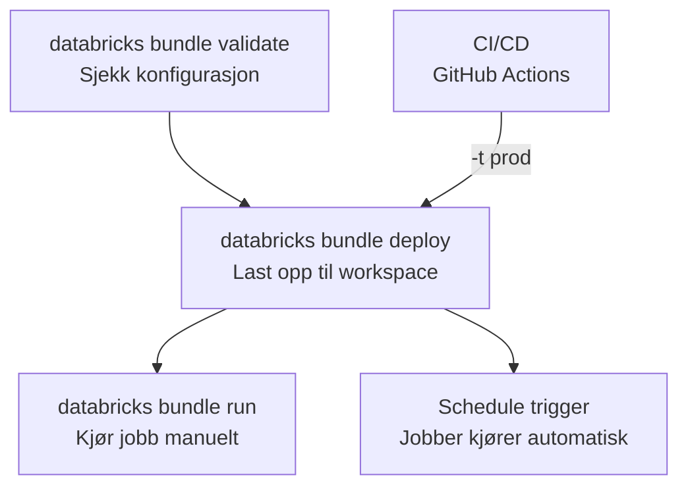

# Declarative Automation Bundles

Declarative Automation Bundles (tidligere *Databricks Asset Bundles / DABs*) lar deg definere jobber, pipelines og artifacts som kode i YAML-filer, og deploye dem til en Databricks-workspace med en enkelt kommando. Tenk på det som infrastruktur-som-kode for Databricks.

## Hvorfor Bundles?

Uten Bundles deployer du manuelt: laster opp notebooks via UI, konfigurerer jobber med pek-og-klikk, og håper på at stage og prod er like. Det fungerer for en utvikler og et miljø, men bryter sammen når du trenger:

- **Reproduserbarhet** — en ny utvikler skal kunne deploye hele pipelinen uten hjelp.
- **Miljø-separasjon** — samme kode skal kjøre i stage med lavere ressurser og i prod med schedules og alarmer.
- **Versjonskontroll** — endringer i jobbkonfigurasjon skal versjoneres, reviewes og rulles tilbake pa lik linje med koden.

Bundles løser dette ved at alt — jobbdefinisjoner, cluster-konfigurasjon, variabler og tilganger — lever i Git sammen med koden.

## Din Kode, flere workspaces

Kjerneproblemet er enkelt: du har *en* kodebase, men *to eller flere* Databricks-workspaces med ulike hosts, kataloger, rettigheter og schedules. Bundles løser dette med **targets** og **modes**.



### Targets — en konfigurasjon per miljø

En *target* er en navngitt deploy-destinasjon. Hvert target peker på et workspace og kan overstyre variabler:

```yaml
targets:
  stage:
    workspace:
      host: https://stage-workspace.cloud.databricks.com
    variables:
      catalog: stage_catalog

  prod:
    workspace:
      host: https://prod-workspace.cloud.databricks.com
    variables:
      catalog: prod_catalog
```

Når du kjører `databricks bundle deploy`, brukes default-target (typisk `stage`). Med `databricks bundle deploy -t prod` brukes prod-target. Selve jobbdefinisjonen er identisk — bare destinasjonen endres.

Noen team bruker tre targets (`sandbox`, `stage`, `prod`) der `sandbox` kun er ment for uttesting av funksjonalitet i databricks.

### Modes — development vs. production

Hvert target har en *mode* som endrer hvordan Bundles oppfører seg:

| Egenskap | `development` | `production` |
|----------|:-------------|:-------------|
| Navneprefix | `[dev <brukernavn>]` legges til alle ressurser | Ingen prefix — ressurser får det faktiske navnet |
| Schedules og triggers | Deaktiveres automatisk | Aktive — jobber kjører som planlagt |
| Root path | Under brukerens personlige mappe | Delt sti, typisk `/Shared/.bundle/prod/` |
| Validering | Minimal | Streng — krever `permissions` eller `run_as` |
| Isolering | Hver utvikler får sin egen kopi | En felles kopi for hele teamet |

!!! tip "Bruk development-mode lokalt"
    I `development`-mode far alle ressurser et prefix med brukernavnet ditt. Det betyr at to utviklere kan deploye samtidig uten a overskrive hverandres jobber.

`production`-mode krever at du eksplisitt definerer hvem som eier ressursene — enten gjennom `permissions` (hvem kan se/styre) eller `run_as` (hvilken bruker/service principal kjører jobbene). Dette forhindrer at produksjonsjobber avhenger av en enkelt utviklers konto.

## Wheels

Python wheels er en vanlig kilde til frustrasjon i Databricks. På en lokal maskin kjører du `pip install` og alt fungerer. På et Databricks-cluster er situasjonen annerledes.

### Hvorfor klustre ikke har internett

Databricks-klustre i Padda kjører i et isolert nettverk uten utgående internettilgang. Det betyr at `pip install <pakke>` fra PyPI ikke fungerer. I stedet må wheel-filer være tilgjengelige *inne i* workspacen — enten på en Unity Catalog Volume eller som en del av bundle-deployen.

### To strategier for wheel-distribusjon

Det finnes 2 måter å levere wheels til klustrene på. Hvilken som passer avhenger av om du bygger koden selv eller bruker tredjepartsbiblioteker.

| Strategi | Brukstilfelle | Fordeler | Ulemper |
|----------|:-------------|:---------|:--------|
| **Manuell opplasting til UC Volume** | Tredjepartsbiblioteker du ikke bygger selv (f.eks. `openpyxl`) | Enkel og eksplisitt, fungerer uten build-steg | Manuelt vedlikehold, vanskelig a holde i sync mellom workspaces |
| **`artifacts`-seksjonen** | Ditt eget prosjekt med `pyproject.toml` | Bygger wheel automatisk ved deploy, versjonering integrert | Krever at prosjektet har en gyldig `pyproject.toml` |

**`artifacts`-seksjonen** er den anbefalte strategien for din egen kode. Den ber Bundles om a bygge en wheel før deploy:

```yaml
artifacts:
  python_artifact:
    type: whl
    build: uv build --wheel
```

For tredjepartsbiblioteker som `openpyxl` — der du ikke har kildekoden — er manuell opplasting til en UC Volume den enkleste løsningen. Se [Laste opp Python-biblioteker](../../guider/bearbeide-data/laste-opp-python-biblioteker.md) for en steg-for-steg-guide.

!!! Tip "Fler alternativ finnes"
    Lag et script som sjekkes inn og legg wheels i gitignore.
    Vær kreativ...

### Versjoneringskonflikter i development-mode

Et kluster cacher wheel-filer. Hvis du deployer en ny versjon av wheelen med samme versjonsnummer, kan klusteret fortsette a bruke den gamle. I `development`-mode løser du dette med presetet `artifacts_dynamic_version`:

```yaml
targets:
  stage:
    mode: development
    presets:
      artifacts_dynamic_version: true
```

Dette legger til et unikt tidsstempel i versjonsnummeret ved hver deploy, slik at klusteret alltid henter den nyeste wheelen. I `production`-mode bruker du faste versjonsnummer fra `pyproject.toml` — der er det CI/CD-pipelinen som sikrer at riktig versjon deployes.

## Deployflyt

Fra lokal kode til jobb som kjører, følger denne flyten:



Lokalt kjører utviklere `validate` og `deploy` mot stage-target. I CI/CD-pipelinen (GitHub Actions) kjører `deploy -t prod` med en service principal som har tilgang til prod-workspacen. Service principals er maskinbrukere som ikke er knyttet til en enkelt persons konto — det sikrer at prod-jobber fortsetter å kjøre selv om en utvikler slutter.

## Avveininger og begrensninger

Bundles dekker deploy av jobber, pipelines og artifacts. De dekker *ikke*:

- **Secrets** — hemmeligheter må konfigureres separat i Databricks-workspacen (TODO: LINKE!)
- **Cluster policies** — administreres av plattformteamet, ikke av den enkelte bundle
- **Rollback** — det finnes ingen innebygd rollback-mekanisme; du deployer forrige versjon på nytt fra Git
- **Workspace-oppretting** — workspacen må eksistere før du deployer til den

Se [Ta i bruk Bundles](../../guider/bearbeide-data/ta-i-bruk-bundles.md) for en praktisk guide til å deploye din første bundle, og [Declarative Automation Bundles (referanse)](../../referanse/databricks-bundles.md) for konfigurasjonsfelt og tilgjengelige eksempler.
