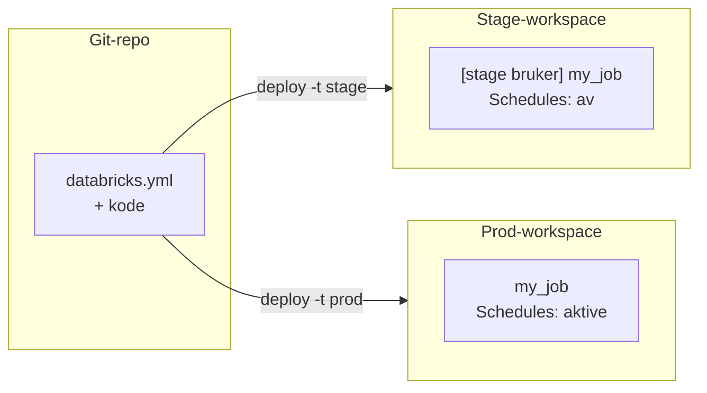
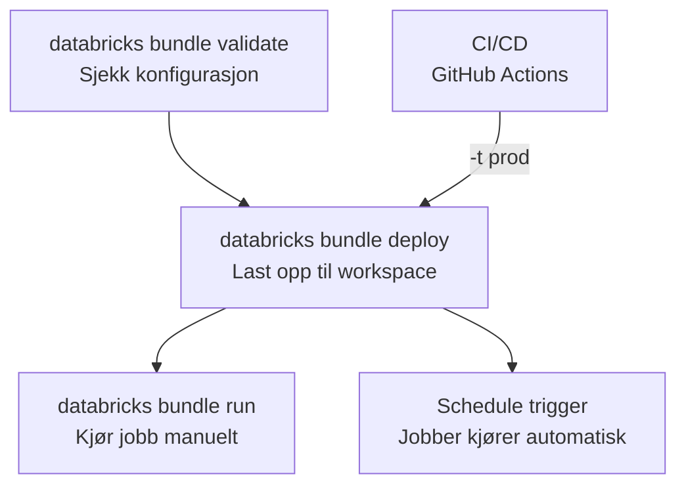

# Declarative Automation Bundles

Declarative Automation Bundles (tidligere *Databricks Asset Bundles / DABs*) lar
deg definere jobber, pipelines og artifacts som kode i YAML-filer, og deploye
dem til et Databricks-workspace med én enkelt kommando. Tenk på det som
infrastruktur-som-kode (IaC) for Databricks.

## Hvorfor bundles?

Uten bundles deployer du manuelt: laster opp notebooks via det grafiske
brukergrensesnittet, konfigurerer jobber med pek-og-klikk, og håper at stage og
prod er like. Det fungerer for én utvikler og ett miljø, men bryter sammen når
du trenger:

- **Reproduserbarhet** — en ny utvikler skal kunne deploye hele pipelinen uten
  hjelp.
- **Miljøseparasjon** — samme kode skal kjøre i stage med lavere ressurser og i
  prod med schedules og alarmer.
- **Versjonskontroll** — endringer i jobbkonfigurasjon skal versjoneres,
  reviewes og rulles tilbake på lik linje med koden.

Bundles løser dette ved at alt — jobbdefinisjoner, cluster-konfigurasjon,
variabler og tilganger — lever i Git sammen med koden.

## Din kode, flere workspaces

Kjerneproblemet er enkelt: du har *en* kodebase, men *to eller flere*
Databricks-workspaces med ulike hosts, kataloger, rettigheter og
schedules. Bundles løser dette med **targets** og **modes**.



### Targets — en konfigurasjon per miljø

Et *target* er en navngitt deploy-destinasjon. Hvert target peker på et
workspace og kan overstyre variabler:

```yaml
targets:
  stage:
    workspace:
      host: https://stage-workspace.cloud.databricks.com
    variables:
      catalog: stage_catalog

  prod:
    workspace:
      host: https://prod-workspace.cloud.databricks.com
    variables:
      catalog: prod_catalog
```

Når du kjører `databricks bundle deploy`, brukes default-target (typisk
`stage`). Med `databricks bundle deploy -t prod` brukes prod-target. Selve
jobbdefinisjonen er identisk — bare destinasjonen endres.

Noen team bruker tre targets (`sandbox`, `stage`, `prod`) der `sandbox` kun er
ment for uttesting av funksjonalitet i Databricks.

### Modes — development vs. production

Hvert target har en *mode* som endrer hvordan bundles oppfører seg:

| Egenskap              | `development`                                  | `production`                                                                                   |
|-----------------------|:-----------------------------------------------|:-----------------------------------------------------------------------------------------------|
| Navneprefiks          | `[dev <brukernavn>]` legges til alle ressurser | Ingen prefiks — ressurser får det faktiske navnet                                              |
| Schedules og triggers | Deaktiveres automatisk                         | Aktive — jobber kjører som planlagt                                                            |
| Root path             | Under brukerens personlige mappe               | Eksplisitt sti, typisk `~/.bundle/<bundle>/<target>` under hjemområdet til service principalen |
| Validering            | Minimal                                        | Streng — krever eksplisitt `root_path` eller service principal/`run_as`                        |
| Isolasjon             | Hver utvikler får sin egen kopi                | En felles kopi for hele teamet                                                                 |

!!! tip "Bruk development-mode lokalt"
    I `development`-mode får alle ressurser et prefiks med brukernavnet ditt. Det
    betyr at to utviklere kan deploye samtidig uten å overskrive hverandres jobber.

`production`-mode krever at deployen er entydig: enten setter du
`workspace.root_path` eksplisitt i prod-targetet, eller så deployer du som
service principal (eventuelt med `run_as` på jobbene). I tillegg anbefales
`run_as` (hvilken bruker/service principal kjører jobbene) og `permissions`
(hvem kan se/styre) for å gjøre eierskapet tydelig — det forhindrer at
produksjonsjobber avhenger av en enkelt utviklers konto.

For konkret YAML-oppsett av targets og modes, se [Ta i bruk bundles —
Konfigurere targets for stage og
prod](../../guider/utvikle-og-deploye/ta-i-bruk-bundles.md#konfigurere-targets-for-stage-og-prod).

### Root path og eierskap i prod

Anbefalt mønster for prod-target er `root_path:
~/.bundle/${bundle.name}/${bundle.target}`. `~/` refererer til hjemområdet til
identiteten som deployer, for prod deploy-service principalen fra GitHub
Actions, som også står i `run_as`. Eierskapet blir dermed tydelig knyttet til
service principalen som faktisk eier ressursene, og leter du opp ressursene i
workspacet, finner du dem under service principalens mappe.

Target-suffikset er en billig forsikring mot at stage- og prod-deploy ender oppå
hverandre om noen ved et uhell deployer feil target til samme workspace. I
`development`-mode setter bundlen en tilsvarende sti automatisk under brukerens
hjemområde, så `root_path` trenger normalt bare settes eksplisitt i prod-target.

## Wheels

Python wheels er en vanlig kilde til frustrasjon i Databricks. På en lokal
maskin kjører du `pip install` og alt fungerer. I et Databricks-cluster er
situasjonen annerledes.

### Hvorfor clustere ikke har internett

Databricks-clustere i Padda kjører i et isolert nettverk uten utgående
internettilgang. Det betyr at `pip install <pakke>` fra PyPI ikke fungerer. I
stedet må wheel-filer være tilgjengelige *inne i* workspacet — enten på en Unity
Catalog Volume eller som en del av bundle-deployen.

### Hvor kommer wheelet fra?

Bundles laster alltid opp wheels under `dist/` til workspacet som en del av en
deploy. Det som varierer er hvordan wheelet havner der i utgangspunktet — om det
bare *samles inn* som en ferdig fil eller om det må *bygges* fra kildekode.

**Tredjepartsbiblioteker**, som for eksempel `openpyxl`, har ikke noe byggesteg,
wheelet er allerede tilgjengelig på PyPI. Du *vendorer* det: kjører `pip
download` før deploy slik at wheelet havner under `dist/deps/`, og legges ved
bundlen som en vanlig fil. Da følger versjonen av tredjepartsbiblioteket samme
livssyklus som koden din og endres gjennom samme PR-flyt.

**Din egen kode** har derimot et byggesteg. `artifacts`-seksjonen i
`databricks.yml` automatiserer det ved å kjøre en build-kommando før deploy:

```yaml
artifacts:
  python_artifact:
    type: whl
    build: uv build --wheel
```

Resultatet havner i `dist/` og lastes opp sammen med bundlen.

I noen tilfeller kan en avhengighet som er stor, eller som deles på tvers av
mange bundles, legges på et Unity Catalog Volume og refereres derfra. Se [Laste opp
Python-biblioteker](../../guider/utvikle-og-deploye/laste-opp-python-biblioteker.md)
for hvordan, og merk at versjonen da ikke følger koden — du må oppdatere volumet
manuelt når du oppgraderer avhengigheten.

For praktisk YAML-oppsett av begge mønstre, se [Ta i bruk bundles — Håndtere
Python
wheels](../../guider/utvikle-og-deploye/ta-i-bruk-bundles.md#handtere-python-wheels).

### Versjoneringskonflikter i development-mode

Et cluster cacher wheel-filer. Hvis du deployer en ny versjon av wheelet med
samme versjonsnummer, kan clusteret fortsette å bruke det gamle. I
`development`-mode løser du dette med presetet `artifacts_dynamic_version`, som
legger til et unikt tidsstempel i versjonsnummeret ved hver deploy slik at
clusteret alltid henter det nyeste wheelet. I `production`-mode bruker du faste
versjonsnummer fra `pyproject.toml` — der er det CI/CD-pipelinen som sikrer at
riktig versjon deployes.

For praktisk YAML-oppsett, se [Ta i bruk bundles — Ditt eget prosjekt:
artifacts-seksjonen](../../guider/utvikle-og-deploye/ta-i-bruk-bundles.md#ditt-eget-prosjekt-artifacts-seksjonen).

## Deployflyt

Fra lokal kode til jobb som kjører følges denne flyten:



Lokalt kjører utviklere `validate` og `deploy` mot stage-target. I
CI/CD-pipelinen (GitHub Actions) kjøres `deploy -t prod` med en service
principal som har tilgang til prod-workspacet. Service principals er
maskinbrukere som ikke er knyttet til en enkelt persons konto — det sikrer at
prod-jobber fortsetter å kjøre selv om en utvikler slutter.

## Avveininger og begrensninger

Bundles dekker deploy av jobber, pipelines og artifacts. De kan også eie Unity
Catalog Volumes for data som er tett koblet til koden — men da sletter `bundle
destroy` også volumet og dataene i det. Se [Deklarere volumes som
bundle-ressurser](../../guider/utvikle-og-deploye/ta-i-bruk-bundles.md#deklarere-volumes-som-bundle-ressurser)
i guiden for detaljer.

Bundles dekker *ikke*:

- **Secrets** — håndteres separat fra bundles. Se [Håndtere
  secrets](../../guider/utvikle-og-deploye/haandtere-secrets.md).
- **Plattformressurser** — workspaces, kataloger, schemas som deles på tvers av
  team, og cluster policies eies av `padda-iac`, ikke av den enkelte
  bundle. Workspacet må eksistere før du deployer til det. Se [Ansvarsfordeling
  mellom bundles og
  padda-iac](../../referanse/databricks-bundles.md#ansvarsfordeling-mellom-bundles-og-padda-iac).
- **Rollback** — det finnes ingen innebygd rollback-mekanisme; du deployer
  forrige versjon på nytt fra Git

## Trenger du hjelp?

- Se [Ta i bruk bundles](../../guider/utvikle-og-deploye/ta-i-bruk-bundles.md) for
  en praktisk guide til å deploye din første bundle
- Se [Declarative Automation Bundles
  (referanse)](../../referanse/databricks-bundles.md) for konfigurasjonsfelt og
  eksempler
- Spør i [#dig-dataspeilet-support](https://oslokommune.slack.com/archives/C01DE13PLDP)
  på Slack
