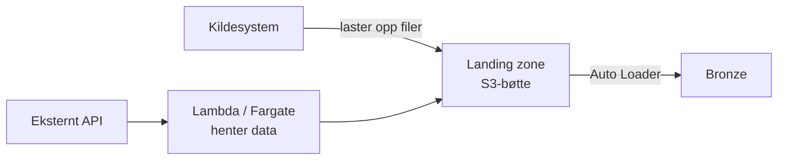

# Datainnlasting

Denne siden forklarer de to veiene data kan komme inn i plattformen: kilden leverer, eller
plattformen henter. Den tar også for seg valgene du står overfor når innlastinga skal
struktureres i pipelines og jobber. Det overordnede bildet av plattformen står i
[Arkitektur](arkitektur.md).

## Levere eller hente

Skillet mellom de to veiene handler om hvem som kan ta initiativet:

- **Kilden leverer (push).** Et system teamet rår over laster selv opp filer til landing
  zone. Kilden bestemmer når og hvor ofte. Se [Laste opp filer til landing
  zone](../../guider/hente-inn-data/laste-opp-til-landing-zone.md).

- **Plattformen henter (pull).** Noen kilder kan ikke levere, typisk eksterne API-er som
  bare svarer på forespørsler. Databricks-clusterne kan ikke gjøre slike kall selv: de
  kjører i et isolert nettverk uten internettilgang, et bevisst sikkerhetsvalg som
  [reduserer angrepsflaten](arkitektur.md#avveininger-og-begrensninger). I stedet henter
  en [serverless-tjeneste](serverless-compute.md) i AWS dataene og skriver dem som filer
  til landing zone. Se [Hente data via
  API](../../guider/hente-inn-data/hente-data-via-api.md).

Begge veiene ender i filer i landing zone, og derfra er flyten identisk. Valget mellom
push og pull er altså bare et spørsmål om hva kilden støtter, det påvirker ikke hvordan
resten av dataproduktet bygges.

## Hvorfor data går gjennom landing zone

[Landing zone](../../referanse/landing-zone.md) er en S3-bøtte som hører til workspacet,
og den er et bevisst enkelt grensesnitt: en kilde trenger bare å kunne skrive filer til
S3. Den enkelheten tjener flere formål på én gang:

- **Frikobling.** Kilden vet ingenting om Databricks, kataloger eller tabeller, og
  plattformen vet ingenting om kilden utover filene den leverer. Begge sider kan endres
  uten å koordinere med den andre.

- **Buffer.** Kilden leverer når det passer den, plattformen leser når det passer
  plattformen. Filene blir liggende i mellomtida, så en pipeline som står stille en dag
  tar bare igjen etterslepet ved neste kjøring.

- **Sensitivitet fra første steg.** Hver sender får egne prefikser for `green`, `yellow`
  og `red`, så [konfidensialitetsnivået](klassifisering-sensitivitet.md) skilles allerede
  før dataene når Databricks.

- **Identitet og avgrensing.** Senderen er kildens identitet i plattformen, med
  rettigheter avgrenset til egne prefikser. Hvem som leverer hva, er dermed alltid
  sporbart.

Ikke alt trenger å gå denne veien. Mindre datasett som lastes opp manuelt, for eksempel
Excel-filer, kan legges rett på et Unity Catalog Volume, se [Importere Excel til
Databricks](../../guider/hente-inn-data/importere-excel-til-databricks.md).

## Fra landing zone til bronze

Landing zone er koblet til workspacet gjennom en [External
Location](https://docs.databricks.com/aws/en/connect/unity-catalog/cloud-storage/) som
Dataspeilet setter opp, teamet trenger ikke konfigurere noen tilgang. Innlesinga gjøres
typisk med [Auto Loader](../../guider/hente-inn-data/auto-loader.md), som holder styr på
hvilke filer som allerede er prosessert og leser hver fil nøyaktig én gang. Resultatet
lander i [bronze](klassifisering-datakvalitet.md#bronze-radata-i-delta-format): en
Delta-tabell som speiler kildedataene mest mulig uforandret, med metadata om hvilken fil
hver rad kom fra og når den ble lest inn.

Filene i landing zone slettes ikke automatisk. Hvor lenge de skal beholdes er [teamets
vurdering](../../referanse/landing-zone.md#sletting-og-oppbevaring). Hvorfor filene bør
bli liggende, står under [vanlige
spørsmål](#kan-vi-slette-filene-i-landing-zone-etter-innlasting).

## Én pipeline eller flere

Skal bronze- og silver-tabellene ligge i samme [Declarative
Pipeline](https://docs.databricks.com/aws/en/ldp/), eller i hver sin?
[Eksempelbundlene](https://github.com/oslokommune/padda-databrikker/tree/main/bundles) for
innlasting legger dem i samme, men for produktet ditt er det et valg du bør ta
bevisst. Begge løsningene har sine fordeler og ulemper:

**Samme pipeline** gir én enhet å deploye, kjøre og overvåke, og hele veien fra fil til
renset tabell vises i én og samme kjøring. Prisen er delt skjebne: feiler en
silver-tabell, feiler kjøringa som helhet, og pipelinen står rød til feilen er rettet,
selv om bronze-dataene som rakk å bli lest inn er trygt lagret. En full refresh av hele
pipelinen omfatter dessuten bronze, med konsekvensene beskrevet under [vanlige
spørsmål](#kan-vi-slette-filene-i-landing-zone-etter-innlasting). En full refresh kan
riktignok avgrenses til enkelttabeller.

**Hver sin pipeline** skiller innlasting fra transformasjon. Bronze fortsetter å fylles
selv om transformasjonslogikken har en feil. De to kan kjøre i hver sin rytme, for
eksempel innlasting hver time og transformasjon én gang i døgnet, og en full refresh av
transformasjonene kan aldri røre bronze. Prisen er flere ressurser å konfigurere og
overvåke, og at rekkefølgen mellom dem må styres et annet sted, i jobben.

Ved splitting er bronze det naturlige skillepunktet: en streaming-tabell kan leses videre
av andre pipelines, mens et materialisert view ikke kan brukes som strømmekilde.

## Egen jobb eller task i en større jobb

En pipeline kjører ikke av seg selv: den startes manuelt, av en jobb med en
pipeline-task, eller via API-et. Tidsplanen bor med andre ord i jobben, og også her er
det to mønstre:

**Én jobb per pipeline** er det
[eksempelbundlene](https://github.com/oslokommune/padda-databrikker/tree/main/bundles)
gjør: en jobb med én pipeline-task, daglig trigger og e-postvarsling ved feil. Det er
enkelt, og hver pipeline får sin egen tidsplan og sine egne varsler. Men rekkefølge på
tvers kommer ikke gratis: enten planlegges jobbene med tidsluke, som ryker den dagen den
første kjøringa tar lengre tid enn luka, eller så må den andre jobben [trigges av
tabelloppdateringer](https://docs.databricks.com/aws/en/jobs/triggers) i stedet for av en
tidsplan.

**Én jobb for hele dataproduktet** samler flere tasks med avhengigheter: innlastinga
kjører først, deretter transformasjonene, til slutt for eksempel en
[kvalitetssjekk](../../guider/overvaake-og-drifte/bruke-dqx.md) eller en
[oppdatering av Power
BI-modellen](../../guider/dele-og-hente-ut/oppdatere-power-bi-modeller-automatisk.md).
Rekkefølgen er garantert, og kjørehistorikk og varsling for hele produktet er samlet på
ett sted. Til gjengjeld følger alt samme tidsplan.

## Vanlige spørsmål

### «Betyr streaming sanntid?»

Nei. Streaming-tabeller og Auto Loader handler om *inkrementell* prosessering: hver fil
leses én gang, og bare nye filer leses ved neste kjøring. Det sier ingenting om hvor ofte
kjøringene skjer: pipelines på plattformen kjører planlagt, typisk daglig. Plattformen er
[ikke bygget for sanntidsstrømmer](arkitektur.md#avveininger-og-begrensninger).

### «Kan vi slette filene i landing zone etter innlasting?»

Auto Loader leser hver fil bare én gang, så det kan virke ryddig å slette filer som er
lest inn. Men en *full refresh* av en bronze-tabell tømmer tabellen og leser alt inn på
nytt fra landing zone, og rader som tilhører filer som er borte, forsvinner da fra
tabellen. Så lenge filene ligger der, kan bronze alltid gjenskapes. Slett dem bare som et
bevisst valg om å gi fra deg den muligheten.

## Relatert innhold

**Forklaringer:**

- [Arkitektur](arkitektur.md) — det store bildet av hvordan delene henger sammen
- [Klassifisering av datakvalitet](klassifisering-datakvalitet.md) — hva bronze, silver og
  gold representerer
- [Serverless compute](serverless-compute.md) — Lambda og Fargate for pull-basert
  innlasting

**Guider:**

- [Laste opp filer til landing zone](../../guider/hente-inn-data/laste-opp-til-landing-zone.md)
- [Hente data via API](../../guider/hente-inn-data/hente-data-via-api.md)
- [Sette opp Auto Loader](../../guider/hente-inn-data/auto-loader.md)
- [Importere Excel til Databricks](../../guider/hente-inn-data/importere-excel-til-databricks.md)

**Referanser:**

- [Landing zone](../../referanse/landing-zone.md) — bøttestruktur, sendere, autentisering
  og oppbevaring

**Kom i gang:**

- [Bygg din første datapipeline](../../kom-i-gang/din-forste-datapipeline.md) — fra fil
  til tabell i praksis
