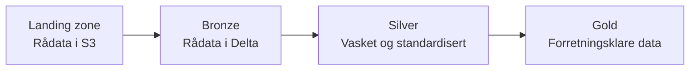

# Klassifisering av datakvalitet

Data som kommer inn i plattformen er sjelden klar til bruk med én gang. Formater varierer, kolonnenavn er inkonsistente, rader kan være dupliserte, og verdier kan mangle eller være ugyldige. For å håndtere dette bruker plattformen en lagdelt modell — **medallion-arkitekturen** — der data beveger seg gjennom tre kvalitetsnivåer: bronze, silver og gold. Hvert lag har et tydelig formål, og transformasjonene mellom dem er det som gradvis gjør rådata om til pålitelige, forretningsklare datasett.

Denne siden forklarer _hvorfor_ vi bruker denne modellen og hva hvert lag representerer. For praktisk veiledning om hvordan du bygger pipelines mellom lagene, se lenkene under [Relatert innhold](#relatert-innhold).

## Det store bildet

Medallion-arkitekturen er en del av den overordnede plattformarkitekturen. Kildesystemer leverer data til en landing zone i S3. Derfra lastes data inn i bronze-laget, transformeres videre til silver, og til slutt til gold — der den er klar for analyse, rapportering og deling.

Modellen er ikke unik for oss. Den er en [veletablert arkitektur](https://www.databricks.com/glossary/medallion-architecture) i Databricks-økosystemet og i dataingeniørfaget generelt. Vi bruker den fordi den gir en felles struktur som alle team kan forholde seg til, uavhengig av hvilke data de jobber med.

## Hvorfor lagdeling

Det kan virke unødvendig å lagre data tre ganger i stedet for å vaske den én gang og skrive resultatet rett til en ferdig tabell. Men lagdelingen løser flere problemer som blir tydelige når man jobber med data over tid:

**Reproduserbarhet.** Når rådata er bevart i bronze, kan du alltid gå tilbake og kjøre transformasjonene på nytt. Hvis du oppdager en feil i forretningslogikken tre måneder senere, trenger du ikke hente data fra kilden på nytt — du kan re-prosessere fra bronze.

**Sporbarhet.** Hvert lag dokumenterer et steg i prosessen. Du kan inspisere bronze for å se nøyaktig hva som kom inn, silver for å se hva som ble renset bort, og gold for å se hva sluttbrukerne faktisk får. Dette gjør feilsøking enklere.

**Uavhengighet mellom steg.** Innlasting og transformasjon er separate operasjoner. Hvis en transformasjon feiler, mister du ikke rådata. Hvis formatet på kilden endrer seg, ser du det i bronze uten at silver og gold blir ødelagt.

**Gjenbruk.** Samme bronze- og silver-data kan brukes som grunnlag for flere gold-tabeller. Ulike team kan bygge forskjellige dataprodukter fra den samme silver-kilden uten å duplisere innlastingsarbeidet.

## Hva hvert lag representerer

### Bronze — rådata i Delta-format

Bronze skal speile kildedata mest mulig, men lagret som Delta-tabeller. Formålet er å få data ut av kildesystemet og inn i plattformen så raskt og uforandret som mulig.

Typiske egenskaper:

- Kolonner og verdier er som de var i kilden — inkludert eventuelle feil
- Kolonnetyper er ofte `STRING` for å unngå at typefeil stopper innlastingen
- Metadata som `source_file_path`, `source_file_modified_at` og `ingested_at` legges til for sporbarhet
- Ingen deduplisering eller filtrering

Bronze er ikke ment å brukes direkte i analyser. Det er et sikkerhetsnett som gjør det mulig å re-prosessere data når nødvendig, uten å måtte laste inn igjen fra kildesystemet.

### Silver — vasket og standardisert

Silver er resultatet av å rense og standardisere bronze-data. Her gjør du de transformasjonene som er nødvendige for at data skal bli konsistent og pålitelig, uavhengig av hva den skal brukes til etterpå.

Typiske transformasjoner:

- Kolonnenavn standardiseres (f.eks. `snake_case`)
- Datatyper settes riktig (strenger blir datoer, heltall osv.)
  - Kolonner med verdier som aldri skal være `NULL` settes til `NOT NULL`
- Duplikater fjernes
- Ugyldige rader filtreres bort eller flagges
- Expectations brukes for å sjekke at verdier er innenfor forventede rammer
- Primærnøkler og sekundærnøkler defineres
- Data normaliseres til [tredje normalform](https://en.wikipedia.org/wiki/Third_normal_form)

Silver-data er rensket. Dette nivået representerer en sannferdig, standardisert, og ryddig versjon av dataen, uten hensyn til hvordan den skal brukes.

### Gold — forretningsklare data

Gold er tilpasset konkrete bruksområder. Her aggregeres, kombineres og berikes data for å svare på konkrete forretningsspørsmål.

Typiske transformasjoner:

- Tabeller fra flere silver-kilder kobles sammen
- Aggregeringer beregnes (summer, gjennomsnitt, antall)
- Forretningslogikk anvendes (klassifiseringer, utledede kolonner)
- Data struktureres for rapportering og BI-verktøy

Gold-tabeller er det som utgjør [dataprodukter](./dataprodukter.md). De skal være dokumenterte, pålitelige og forståelige for sluttbrukerne — uten at de trenger å vite noe om transformasjonene som ligger bak.

## Avveininger

Medallion-arkitekturen er ikke uten kostnad:

- **Lagringsplass.** Data lagres i flere kopier. I praksis er dette sjelden et problem fordi Delta-format komprimerer godt og lagring er billig sammenlignet med verdien av reproduserbarhet.
- **Kompleksitet.** Tre lag betyr flere pipelines å vedlikeholde. For veldig enkle datasett kan det føles som overkill — men strukturen lønner seg så fort kravene endrer seg eller flere team skal gjenbruke data.
- **Latens.** Data må gjennom flere steg før den er klar. For brukstilfeller som krever sanntidsdata kan dette være en begrensning, men for de fleste analytiske formål er forsinkelsen ubetydelig.

Alternativet — å vaske data direkte ved innlasting og kun lagre sluttresultatet — gir lavere kompleksitet på kort sikt, men fjerner muligheten til å re-prosessere og gjør feilsøking vanskeligere. For en plattform der mange team skal samarbeide om data over tid, veier fordelene ved lagdeling tyngre enn ulempene.

Det er ikke slik at dette alltid passer for alle. Systemer der lagringskostnad er et problem eller en begrensning vil måtte ta andre valg. Noen tabeller er for store til at de kan joines innenfor akseptable tidsrammer. Men for de fleste er medallion-arkitekturen et godt valg.

## Vanlige misforståelser

### «Bronze er dårlig data»

Hvert lag har en hensikt. Bronze er ikke dårlig — det er _ubehandlet_. At data er i bronze betyr at den er lagret slik kilden leverte den. Verdien i bronze er nettopp at den er urørt, slik at du alltid har et referansepunkt å gå tilbake til.

### «Alle tre lagene er obligatoriske for alt»

Modellen er en anbefalt struktur, ikke et rigid krav. For noen datasett kan silver og gold i praksis være svært like. Det viktige er at du har en bevisst holdning til hva hvert steg gjør, ikke at du tvinger data gjennom tre lag for lagdelingens skyld.

## Relatert innhold

**Forklaringer:**

- [Datakvalitet](./datakvalitet.md) — hva datakvalitet betyr og avveininger ved automatisering
- [Dataprodukter](./dataprodukter.md) — hva et dataprodukt er og hvilke krav som stilles

**Guider:**

- [Bronze til silver](../../guider/bearbeide-data/bronze-til-silver.md) — rensing, deduplisering og standardisering
- [Silver til gold](../../guider/bearbeide-data/silver-til-gold.md) — aggregering og forretningslogikk
- [Sette opp Auto Loader](../../guider/hente-inn-data/auto-loader.md) — innlasting fra landing zone til bronze

**Referanser:**

- [Verktøy for datakvalitet](../../referanse/datakvalitet.md) — Constraints, Expectations og DQX

**Kom i gang:**

- [Din første datapipeline](../../kom-i-gang/din-forste-datapipeline.md) — ende-til-ende-gjennomgang inkludert medallion-lagene
