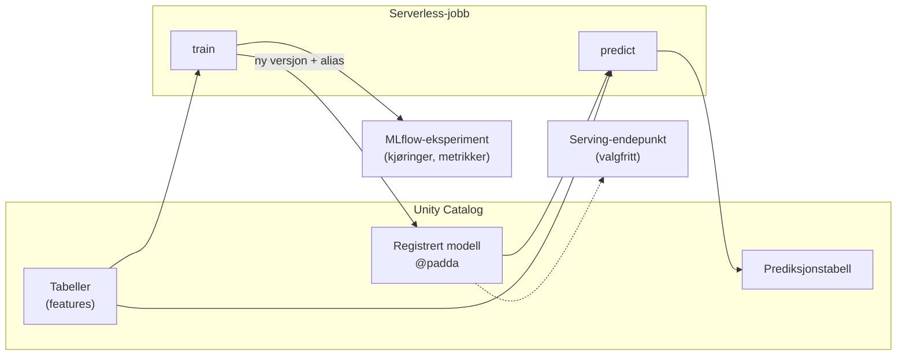

# Maskinlæring på plattformen

Plattformen har en brolagt sti for maskinlæring: du trener en modell i en
jobb, MLflow holder styr på kjøringen, modellen registreres i Unity Catalog, og
en annen jobb bruker den til å skrive prediksjoner til en tabell. Denne siden
forklarer hvorfor stien ser slik ut, og hvordan du velger mellom batch-inferens
og et serving-endepunkt.

Stien er bygget inn i bundle-malen: svarer du `yes` på `include_ml_workflow`,
får du et komplett eksempel som forutsier om et møterom er booket på et gitt
tidspunkt. Eksempelet kjører på syntetiske data, så det fungerer i alle
workspaces uten forarbeid.

## Det store bildet

- **Data og modell bor samme sted.** Features, den registrerte modellen og
  prediksjonene ligger i ett skjema i Unity Catalog, eid av bundlen som
  trener modellen.
- **Treningsjobben** logger til et MLflow-eksperiment og registrerer en ny
  modellversjon hver gang den kjører.
- **Batch-jobben** laster modellen som bærer aliaset `padda` og skriver
  prediksjoner til en Delta-tabell. Den vet ikke hvilken versjon den bruker,
  og trenger ikke vite det.
- **Serving-endepunktet** er en ren tilleggsressurs. Det finnes i bundlen,
  men er slått av til noen faktisk trenger prediksjoner på forespørsel.

## Hva MLflow holder styr på

MLflow er innebygd i Databricks; du trenger ikke drifte en tracking-server.
Fire begreper er nok for å lese det treningsjobben etterlater seg:

| Begrep | Hva det er | I eksempelet |
|--------|------------|--------------|
| Eksperiment | En mappe for kjøringer, deklarert som bundle-ressurs | `<bundle>-ml-example` under deployerens brukermappe |
| Kjøring (run) | Én trening: parametere, metrikker per epoke, artefakter | `epochs`, `learning_rate`, `train_loss`, `val_auc`, `val_accuracy` |
| Modellartefakt | Selve modellen med signatur og input-eksempel | PyTorch-modell logget med `mlflow.pytorch.log_model` |
| Registrert modell | Navngitt objekt i Unity Catalog med versjoner og alias | `<katalog>.<skjema>.romledighet` |

Signaturen er viktigere enn den ser ut: den beskriver hvilke kolonner
modellen forventer, i hvilken rekkefølge og med hvilke typer. Batch-jobben og
et eventuelt endepunkt sender nøyaktig de kolonnene, og MLflow avviser input
som ikke passer. Feature-kontrakten i koden (`FEATURE_COLUMNS`) er dermed det
eneste stedet en endring må gjøres.

## Hvorfor modeller registreres i Unity Catalog

MLflow har et eldre modellregister per workspace. Plattformen bruker ikke det.
Modeller registreres i Unity Catalog, av samme grunn som tabeller gjør det:

- **Samme tilgangsstyring.** `EXECUTE` på en modell gis med `GRANT` på lik
  linje med `SELECT` på en tabell, og følger de samme rollene. Se
  [Roller og rettigheter](../../referanse/roller-og-rettigheter.md).
- **Samme navnerom.** Modellen heter `<katalog>.<skjema>.<modell>` og ligger
  ved siden av tabellene den er trent på. Navnekonvensjonene for skjemaer
  gjelder også for modeller.
- **Sporbarhet.** Unity Catalog kobler modellversjonen til kjøringen som
  laget den, og videre til tabellene kjøringen leste.
- **Ett register på tvers av workspaces.** En modell registrert i ett
  workspace kan brukes fra et annet som har tilgang til katalogen.

## Alias, ikke versjonsnummer

Hver trening gir en ny versjon: 1, 2, 3 og så videre. Ingen konsument bør
referere til et versjonsnummer, for da må koden endres hver gang modellen
trenes på nytt. I stedet peker et alias på den versjonen som skal brukes:

- `padda` er versjonen i bruk. Batch-jobben laster alltid
  `models:/<katalog>.<skjema>.<modell>@padda`.
- `utmaner_padda` er en ny versjon som ikke slo den gjeldende.

Treningsjobben i eksempelet flytter aliaset selv: en ny versjon blir
`padda` hvis validerings-AUC er minst like god som dagens padda, ellers
blir den `utmaner_padda`. Regelen er en ren funksjon med enhetstester, og du kan
bytte den ut med hva som helst, for eksempel en manuell godkjenning. Poenget
er at flyttingen av aliaset er den eneste handlingen som endrer hva som kjører
i produksjon.

!!! note "Endepunkter pinner versjon"
    Et serving-endepunkt kan ikke følge et alias; det serverer et bestemt
    versjonsnummer. Når du bytter modell bak et endepunkt, deployer du
    endepunktet på nytt med ny versjon.

## Batch eller endepunkt?

Dette er det viktigste valget, og det handler om *når* prediksjonen trengs,
ikke om hvilken type modell du har. En logistisk regresjon kan trenge et API,
og en språkmodell kan fint kjøre som batch over en tabell.

| Situasjon | Velg |
|-----------|------|
| Prediksjonene brukes i rapporter, dashboards eller nedstrøms tabeller | Batch |
| Det er greit at tallene er fra i natt eller forrige time | Batch |
| Input finnes allerede i en tabell | Batch |
| Et annet system trenger svar på én rad *nå*, for data som ikke finnes i en tabell ennå | Endepunkt |
| Modellen skal deles som API til team uten Databricks-tilgang | Endepunkt |
| Latens under et sekund teller | Endepunkt |
| Konsumenten kan ikke kjøre modellen selv, for eksempel en Lambda uten PyTorch | Endepunkt |

Batch er standardvalget på plattformen. Det er billigst, det bruker de samme
verktøyene som resten av datapipelinene, og prediksjonstabellen er et
dataprodukt som kan deles som alle andre. Et endepunkt legger til et
rettighetslag (hvem kan kalle det), et nettverkslag (hvor kalles det fra) og
en løpende kostnad. Med *scale-to-zero* koster et stille endepunkt lite, men
første kall etter en pause kan ta flere minutter mens det starter.

Derfor ligger endepunktet i eksempelet under `resources/optional/` og er
ikke med i bundlen før du aktivt tar det inn. Se [Publisere en modell som
serving-endepunkt](../../guider/maskinlaering/publisere-serving-endepunkt.md).

## Serverless og ingen internett

Jobbene kjører på serverless compute. Serverless-miljøet kommer med MLflow,
pandas, numpy og scikit-learn, men ikke PyTorch. Siden compute på plattformen
ikke har internettilgang, kan ikke jobben hente PyTorch fra PyPI når den
starter. Løsningen er den samme som for andre tredjepartsbiblioteker: wheels
lastes opp én gang til et Unity Catalog Volume som bundlen eier, og jobben
installerer derfra med `--no-index`. Malen leverer et skript som gjør dette.
Bakgrunnen er forklart i [Hvorfor clustere ikke har
internett](databricks-bundles.md#hvorfor-clustere-ikke-har-internett).

Stien dekker CPU-trening av modeller som er små nok til å trenes på minutter.
GPU og klassiske ML-runtime-clustere er utenfor det malen setter opp; trenger
du det, er startpunktet jobben på klassisk compute i samme mal.

## Avveininger

- **Syntetiske data i eksempelet.** Eksempelet genererer sine egne
  møteromsbookinger. Det gjør at det kjører overalt, men modellen lærer bare
  mønsteret generatoren la inn. Verdien ligger i flyten, ikke i modellen.
- **Liten modell.** Et nettverk med to skjulte lag, bygget av standardlag fra
  `torch.nn`, uten egne klasser. Det gjør at den lagrede modellen kan lastes
  overalt der PyTorch finnes, uten at pakken din må være installert.
- **Uavgjort går til nyeste.** Alias-regelen lar en ny versjon med identisk
  AUC bli padda. Det er bevisst enkelt; strengere regler hører hjemme hos
  teamet som eier modellen.

## Relatert innhold

- [Trene og registrere en modell](../../guider/maskinlaering/trene-og-registrere-modell.md)
- [Kjøre batch-inferens med en registrert modell](../../guider/maskinlaering/batch-inferens.md)
- [Publisere en modell som serving-endepunkt](../../guider/maskinlaering/publisere-serving-endepunkt.md)
- [MLflow og modellregister (referanse)](../../referanse/mlflow-og-modellregister.md)
- [Declarative Automation Bundles](databricks-bundles.md)
