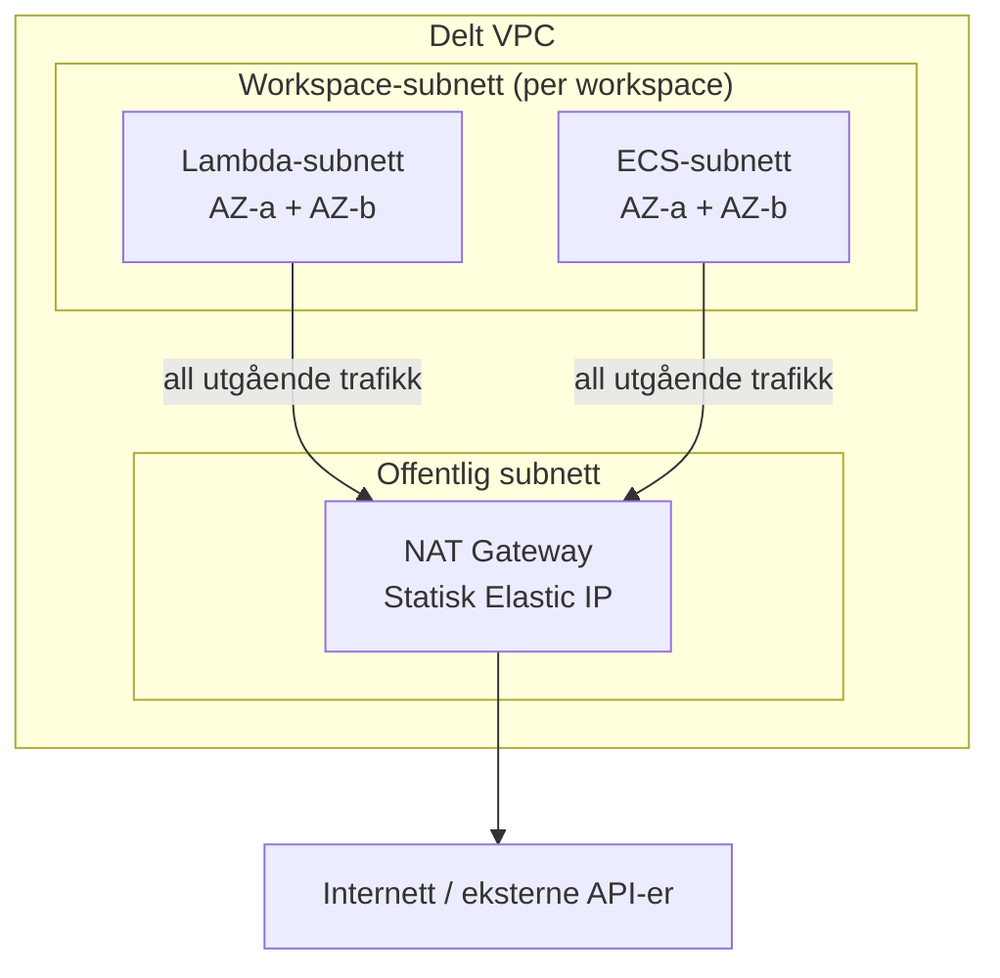

# Serverless compute

Dataplattformen bruker serverless-tjenester i AWS for å kjøre kode som henter data fra eksterne API-er og skriver til landing zone. Denne siden forklarer de tilgjengelige compute-alternativene, hvordan de fungerer, og bakgrunnen for hvert mønster.

## Hvorfor serverless?

Databricks håndterer planlagte jobber og transformasjoner godt, men kan ikke selv nå ut til eksterne API-er. For pull-basert datainnlasting — der plattformen henter data i stedet for å motta dem — trengs et lett compute-lag utenfor Databricks.

Serverless passer godt fordi:

- **Ingen infrastruktur å drifte.** AWS provisjonerer og skalerer compute automatisk.
- **Betal per bruk.** Du betaler bare for tiden koden kjører, ikke for ledige servere.
- **Hendelsesstyrt.** Funksjoner kan trigges av tidsplaner (EventBridge), hendelser eller manuell kjøring.
- **Kortlevd av natur.** De fleste API-kall fullføres på sekunder, noe som gjør serverless kostnadseffektivt.

## Lambda vs. Fargate

Plattformen støtter to serverless compute-tjenester:

### AWS Lambda

Lambda kjører en funksjon som respons på en hendelse. Funksjonen starter, gjør jobben sin, og avsluttes. Lambda er ideelt for korte, fokuserte oppgaver som å hente data fra et API.

**Egenskaper:**

- Maks kjøretid: **15 minutter**
- Maks minne: **10 GB**
- Maks deploy-pakke: **250 MB** (zip) eller **10 GB** (container image)
- Faktureres per millisekund kjøretid
- Cold starts: typisk 100–500 ms (zip), 1–3 sekunder (container)

### Amazon ECS Fargate

Fargate kjører en Docker-container som en ECS-task. Det er ingen tidsbegrensning, og tjenesten støtter vesentlig mer minne og CPU. Bruk Fargate når Lambdas begrensninger er for stramme.

**Egenskaper:**

- Maks kjøretid: **ubegrenset** (ingen timeout)
- Maks minne: **30 GB**
- Maks CPU: **4 vCPU**
- Ingen grense for deploy-størrelse (Docker image)
- Faktureres per sekund kjøretid (minimum 1 minutt)
- Oppstartstid: typisk 30–60 sekunder

### Når bruke hva

| Faktor | Lambda | Fargate |
|--------|--------|---------|
| Jobbvarighet | Under 15 minutter | Vilkårlig varighet |
| Avhengighetsstørrelse | Under 250 MB (zip) eller 10 GB (container) | Ubegrenset |
| Oppstartsfart | Rask (under et sekund til noen sekunder) | Tregere (30–60 sekunder) |
| Kostnad for korte jobber | Svært lav | Høyere (1 min minimum fakturering) |
| Kompleksitet | Enkel template | Flere ressurser å konfigurere |

**Tommelfingerregel:** Bruk Lambda med mindre du har en konkret grunn til å ikke gjøre det. De fleste API-innhentingsjobber fullføres på sekunder og har få avhengigheter — Lambda er det naturlige valget.

## Pakkealternativer for Lambda

Lambda støtter to pakkeformater som bestemmer hvordan koden og avhengighetene dine leveres:

### Zip-pakking

Standard. SAM pakker `src/`-mappen din og `requirements.txt` til en zip-fil, laster opp til S3, og peker Lambda-funksjonen dit.

- Enkelt og raskt å deploye
- Begrenset til **250 MB** utpakket (inkludert avhengigheter)
- Bruker den AWS-administrerte Lambda-runtimen (Python 3.12 på ARM64)

### Container image-pakking

For funksjoner som trenger store avhengigheter (pandas, numpy, scikit-learn osv.) pakker du funksjonen som et Docker-image. SAM bygger imaget og pusher det til ECR.

- Støtter opptil **10 GB** image-størrelse
- Bruker det offisielle AWS Lambda Python-base-imaget (`public.ecr.aws/lambda/python:*`)
- Handler-grensesnittet er det samme — bare pakkeformatet er annerledes
- Noe lengre cold starts sammenlignet med zip

## Statisk IP (VPC-integrasjon)

Noen eksterne API-er krever IP-hvitelisting (white listing) — de godtar bare forespørsler fra et kjent sett IP-adresser. Plattformen har en delt VPC med NAT Gateway som gir en fast utgående Elastic IP for alle serverless-funksjoner.

### VPC-arkitekturen

Plattformteamet provisjonerer en delt VPC på kontonivå via Terraform (`padda-iac`). Denne VPC-en deles mellom alle workspaces i kontoen:

Hvert workspace får dedikerte subnett:

- **Lambda-subnett** — to private subnett (ett per tilgjengelighetssone) for Lambda-funksjoner
- **ECS-subnett** — to private subnett (ett per tilgjengelighetssone) for Fargate-tasks

Subnett-IDer og sikkerhetsgruppe lagres i SSM Parameter Store og kan refereres direkte i SAM-templater.

### Fargate — statisk IP automatisk

Fargate-tasks kjører alltid i VPC-ens ECS-subnett. All utgående trafikk rutes automatisk gjennom NAT Gateway. Du trenger ikke gjøre noe ekstra — statisk IP er inkludert.

### Lambda — statisk IP som tillegg

Lambda kjører som standard *utenfor* VPC-en og har ikke en fast IP-adresse. For å få statisk IP legger du til en `VpcConfig`-blokk i SAM-templaten som plasserer funksjonen i Lambda-subnettene. Dette fungerer for både zip- og container-baserte Lambdaer.

**Avveininger for Lambda i VPC:**

- Legger til **cold start-latens** (1–2 sekunder ekstra) fordi Lambda må opprette et nettverksgrensesnitt (ENI) i VPC-en
- Lambdaen **kan ikke nå det offentlige internett** uten NAT Gateway
- Krever `AWSLambdaVPCAccessExecutionRole` i tillegg til standard execution role

Se [Hente data via API — Legg til statisk IP](../../guider/hente-inn-data/hente-data-via-api.md#legg-til-statisk-ip-lambda) for steg-for-steg-instruksjoner.

## Fargate-roller

En Fargate-task trenger tre IAM-roller, hver med et tydelig formål:

| Rolle | Principal | Formål |
|-------|-----------|--------|
| **TaskExecutionRole** | `ecs-tasks.amazonaws.com` | Lar ECS hente Docker-imaget fra ECR og skrive logger til CloudWatch. Bruker managed policy `AmazonECSTaskExecutionRolePolicy`. |
| **TaskRole** | `ecs-tasks.amazonaws.com` | Rollen applikasjonskoden din kjører med. Gi den tilgangene tasken trenger (f.eks. S3-skriving, SSM-lesing). |
| **EventBridgeRole** | `events.amazonaws.com` | Lar EventBridge trigge `ecs:RunTask` og sende videre execution/task-rollene. Trengs bare hvis du bruker en tidsplan. |

Alle roller krever workspace sin permission boundary.

## SAM og CloudFormation

Alle serverless-ressurser defineres med **AWS Serverless Application Model (SAM)**, som er en utvidelse av CloudFormation. SAM forenkler Lambda- og API Gateway-definisjoner med kortform-syntaks (`AWS::Serverless::Function`) samtidig som den støtter rå CloudFormation-ressurser for ting som ECS-clustere og IAM-roller.

Deploy-pipelinen bruker SAM CLI til å bygge og deploye hver funksjon som en uavhengig CloudFormation-stack. Det betyr at hver funksjon kan deployes, oppdateres og rulles tilbake uavhengig.

Se [SAM-deploy](../../referanse/sam-deploy.md) for teknisk referanse om navnekonvensjoner, tilganger og CI/CD-konfigurasjon.
