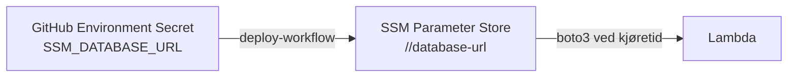
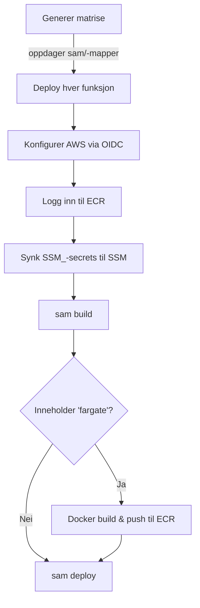

# SAM-deploy

Denne siden dokumenterer konvensjoner og infrastruktur for deploy av serverless-funksjoner (Lambda og Fargate) via AWS SAM på dataplattformen.

## Verktøy

Du trenger følgende verktøy installert lokalt:

| Verktøy | Formål | Installer |
|---------|--------|-----------|
| **SAM CLI** | Bygge og teste SAM-templater | `brew install aws-sam-cli` |
| **Docker** | Påkrevd for container-baserte funksjoner og `sam local invoke` | [docker.com](https://www.docker.com/) |
| **AWS CLI** | AWS-autentisering (valgfritt for lokal testing) | `brew install awscli` |

## Mappestruktur

Hver serverless-funksjon bor i sin egen mappe under `sam/` i deploy-repoet (`padda-databrikker`):

```
padda-databrikker/
└── sam/
    ├── my-api-collector/
    │   ├── template.yaml
    │   └── src/
    │       ├── app.py
    │       └── requirements.txt
    ├── my-container-function/
    │   ├── template.yaml
    │   └── src/
    │       ├── app.py
    │       ├── Dockerfile
    │       └── requirements.txt
    └── my-fargate-task/
        ├── template.yaml
        └── src/
            ├── app.py
            ├── Dockerfile
            └── requirements.txt
```

CI/CD-pipelinen oppdager automatisk alle mapper på dybde 1 under `sam/` og deployer hver enkelt uavhengig.

## Navnekonvensjoner

Alle ressursnavn må starte med workspace-navnet ditt som prefiks. Permission boundary støtter både `-` og `_` som separator etter workspace-navnet. Erstatt `<workspace-name>` med det faktiske workspace-navnet ditt (f.eks. `dig-eksempelteam-stage`).

| Ressurs | Tillatte prefikser | Eksempel |
|---------|-------------------|----------|
| Lambda-funksjonsnavn | `<workspace-name>_` eller `<workspace-name>-` | `<workspace-name>_my-api-collector` |
| IAM-rollenavn | `<workspace-name>-sam-` eller `<workspace-name>_sam-` | `<workspace-name>-sam-my-api-collector-role` |
| CloudFormation-stack | `<workspace-name>-` | `<workspace-name>-my-api-collector` |
| ECS-cluster | `<workspace-name>-` | `<workspace-name>-fargate-cluster` |
| CloudWatch-loggruppe | `/aws/lambda/<workspace-name>_` eller `<workspace-name>-` | `/aws/lambda/<workspace-name>_my-func` |

!!! warning "Deploy feiler uten riktige prefikser"
    Permission boundary blokkerer opprettelse av ressurser som ikke matcher disse prefiksmønstrene. Navnene må starte med riktig prefiks.

## Permission boundary

Hver IAM-rolle i en SAM-template **må** inkludere en permission boundary. Boundary-ARN-en sendes automatisk av deploy-workflowen som `PermissionsBoundaryArn`-parameteren:

```yaml
Parameters:
  PermissionsBoundaryArn:
    Type: String
    Description: Permission boundary ARN (settes automatisk av deploy-workflowen)

Resources:
  MyFunctionRole:
    Type: AWS::IAM::Role
    Properties:
      PermissionsBoundary: !Ref PermissionsBoundaryArn
      # ...
```

Boundary-en begrenser hvilke tilganger rollen kan ha. Den sikrer at workspace-funksjoner ikke kan eskalere privilegier utover det tiltenkte omfanget.

## Secrets via SSM Parameter Store

Hemmeligheter håndteres gjennom GitHub Environment-secrets og synkroniseres til AWS SSM Parameter Store av deploy-workflowen.

### Flyt



### Navnekonvensjon

Deploy-workflowen transformerer secret-navn slik:

1. Fjern `SSM_`-prefikset
2. Gjør om til små bokstaver
3. Erstatt understrek med bindestrek

| GitHub secret-navn | SSM-parameterbane |
|---|---|
| `SSM_DATABASE_URL` | `/<workspace-name>/database-url` |
| `SSM_API_KEY` | `/<workspace-name>/api-key` |
| `SSM_MY_SERVICE_TOKEN` | `/<workspace-name>/my-service-token` |

### Legge til en ny secret

1. Gå til repoets **Settings** → **Environments** → **stage** → **Add secret**
2. Gi den navnet `SSM_<DITT_PARAM_NAVN>` (store bokstaver, understrek)
3. Sett verdien
4. Neste deploy synkroniserer den til SSM som `/<workspace-name>/<ditt-param-navn>`

### Lese secrets ved kjøretid

Send SSM-parameterbanen som en miljøvariabel i `template.yaml`, og hent den med boto3:

```yaml
Environment:
  Variables:
    DB_URL_PARAM: /<workspace-name>/database-url
```

```python
import os
import boto3


def get_secret(param_name: str) -> str:
    ssm = boto3.client("ssm")
    response = ssm.get_parameter(Name=param_name, WithDecryption=True)
    return response["Parameter"]["Value"]


# Bruk
db_url = get_secret(os.environ["DB_URL_PARAM"])
```

!!! warning "Aldri logg hemmeligheter"
    Bruk alltid `WithDecryption=True` og logg aldri den returnerte verdien. Logg parameternavnet og lengden hvis du trenger å verifisere at den ble lest riktig.

## CI/CD-pipeline

Deploy-pipelinen er definert i `.github/workflows/deploy.yml` i `padda-databrikker`.

### Trigger

- **Manuelt:** `workflow_dispatch`
- **Pull requests** til `main`-, `dev`- eller `stage`-brancher

### Slik fungerer det



1. **Matrisegenerering** — oppdager alle `sam/*/`-mapper og oppretter en parallell matrise
2. **AWS-autentisering** — bruker OIDC (ingen lagret legitimasjon) for å assume workspace deploy-rollen
3. **ECR-innlogging** — autentiserer Docker mot ECR-registeret
4. **Secret-synk** — synkroniserer alle `SSM_`-prefiksede GitHub-secrets til SSM Parameter Store
5. **SAM build** — bygger hver funksjon (installerer avhengigheter, pakker kode)
6. **Docker build** (bare Fargate) — bygger og pusher Docker-imaget til ECR
7. **SAM deploy** — deployer CloudFormation-stacken med permission boundary

### Miljøvariabler

Følgende er konfigurert som GitHub Environment-variabler/-secrets for `stage`-miljøet:

| Variabel | Beskrivelse |
|----------|-------------|
| `AWS_REGION` | AWS-region (`eu-west-1`) |
| `SAM_S3_BUCKET` | S3-bucket for SAM-artifakter |
| `CFN_ROLE_ARN` | CloudFormation execution role ARN |
| `PERMISSIONS_BOUNDARY_ARN` | Permission boundary policy ARN |
| `DEPLOY_ROLE_ARN` | OIDC deploy role ARN |
| `WORKSPACE_NAME` | Workspace-navn (f.eks. `dig-eksempelteam-stage`) |
| `ECR_REPOSITORY` | ECR-repository-navn for container images |

## Lokal testing

### Zip-basert Lambda

```bash
cd sam/my-function
sam build
sam local invoke MyFunction
```

### Container-basert Lambda

```bash
cd sam/my-container-function
sam build
sam local invoke MyContainerFunction
```

### Fargate

Fargate-tasks kan ikke testes med `sam local invoke`. Test dem direkte med Docker:

```bash
cd sam/my-fargate-task/src
docker build -t my-fargate-task .
docker run --env LOG_LEVEL=INFO my-fargate-task
```

## Runtimes og arkitekturer

| Mønster | Runtime | Arkitektur |
|---------|---------|------------|
| Lambda — Zip | Python 3.12 | ARM64 (Graviton) |
| Lambda — Container | Python 3.13 (i Dockerfile) | x86_64 (standard for Docker) |
| Fargate | Python 3.13 (i Dockerfile) | x86_64 (standard) |

!!! info "ARM64 for Lambda"
    Zip-baserte Lambdaer bruker ARM64 (Graviton2)-prosessorer, som er mer kostnadseffektive enn x86_64. Container-baserte funksjoner bruker arkitekturen til base-imaget sitt.
