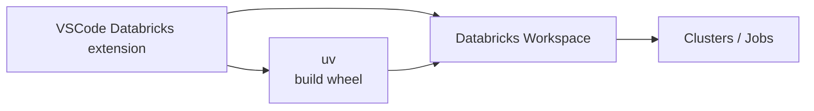

# Oppsett og arkitektur
**Lokalt**

- VS Code
- Databricks VS Code extension
- `uv` for Python-deps og wheels
- Eksempelprosjekt: `examples/vscode-demo`

**Remote (Databricks)**

- Workspace (notebooks, filer, jobs)
- Clusters / serverless compute
---

Mål for demoen

Vis hele flyten fra å redigere `examples/vscode-demo` i VS Code
→ kjøre på Databricks
→ pakke som wheel
→ deploye med bundle
→ og kjøre i isolated mode
